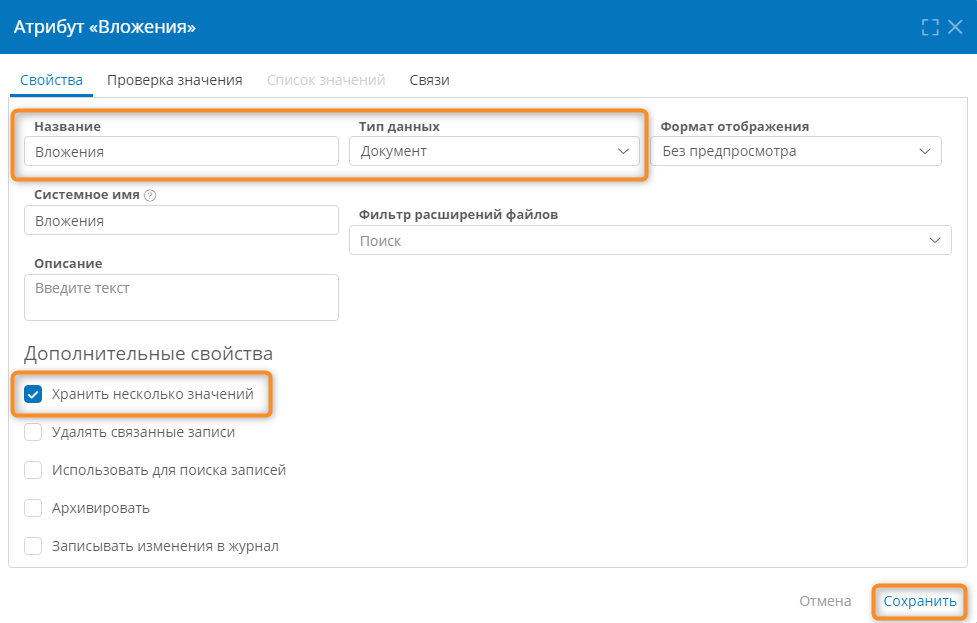
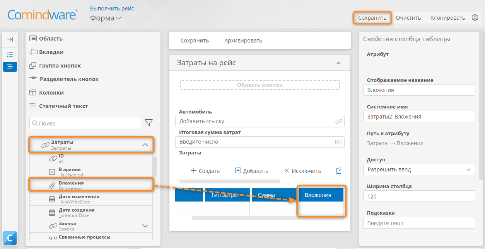

# Урок 10. Работа с файлами {: #lesson_10 }



## Введение

В ходе этого урока вы узнаете, как с помощью **атрибута типа «Документ»** прикреплять к записям (загружать) и скачивать файлы: документы и изображения.

**Предусловие:** пройден _[урок 9 «Формирование документов»][lesson_9]_.

**Расчётная продолжительность:** 45 мин.



## Настройка загрузки документов и изображений

!!! warning "Бизнес-логика"

    После выполнения рейса _Водитель_ должен иметь возможность загрузить в систему сканы квитанций и другие документов.

    Для этого добавим на форму его задачи соответствующее поле.

!!! question "Атрибут типа «Документ»"

    **Атрибут типа «Документ»** хранит файлы, загруженные пользователями.

    При настройке **атрибута типа «Документ»** можно разрешить загрузку файлов только определенных типов или любых файлов.

    Поле документа на форме позволяет загружать, скачивать, удалять и просматривать файлы.

### Создание атрибута типа «Документ»

Добавим **атрибут типа «Документ»** в шаблон _«Затраты»_…

1. Откройте шаблон записи _«Затраты»_.
2. Перейдите на вкладку «**Атрибуты**».
3. Создайте атрибут:

    - **Название:** _Вложения_
    - **Тип данных: документ**
    - **Хранить несколько значений:** установите флажок

4. Сохраните атрибут.

    __

### Добавление поля с документами на форму

Добавим атрибут _«Вложения»_ в таблицу затрат на форме задачи _«Выполнить рейс»_.

1. Откройте шаблон процесса _«Заказ автотранспорта»_.
2. Перейдите к вкладке «**Диаграмма**» и нажмите кнопку «**Редактировать**».
3. Выберите задачу _«Выполнить рейс»_ и в меню элемента нажмите кнопку «**Форма**» <i class="fa-light fa-newspaper">‌</i>.
4. В конструкторе формы задачи на панели элементов разверните шаблон _«Заявки на автомобили»_ и в нём разверните атрибут _«Затраты»_.
5. Перетащите атрибут _«Вложения»_ на форму в таблицу _«Затраты»_.
6. В таблице _«Затраты»_ должен появиться столбец _«Вложения»_.
7. Сохраните форму задачи.

    __

8. Вернитесь к диаграмме процесса и опубликуйте её.

## Тестирование загрузки и скачивания документа



1. Создайте новую заявку на автомобиль и пройдите бизнес-процесс до задачи _«Выполнить рейс»_.
2. На форме задачи _«Выполнить рейс»_ создайте запись в таблице _«Затраты»_.
3. Прикрепите текстовый документ (например, в формате PDF) к созданной записи:

    - Нажмите в строке затрат поле _«Вложение»_.
    - Нажмите кнопку «**Добавить документ**».

4. Создайте ещё одну запись в таблице _«Затраты»_.
5. Прикрепите изображение (например, в формате JPG) ко второй строке затрат.
6. Сохраните заявку.
7. Проверьте возможность скачивания загруженных документов из заявки:

    - Нажмите название загруженного документа или изображения в таблице затрат.
    - Браузер скачает прикрепленный файл.

__

## Результаты

Вы научились работать с файлами: загружать в систему и скачивать документы и изображения.


