# Урок 2. Мой первый реестр данных {: #lesson_2 }

## Введение

В рамках обучения мы разработаем корпоративное приложение для заказа корпоративного транспорта.

В ходе этого урока вы создадите **приложение**, **шаблон записи** (реестр заявок), настроите **атрибуты** для хранения данных заявок, их отображение в виде **таблицы** и **формы**, а затем оформите несколько заявок.

!!! warning "Бизнес-логика"

    Мы реализуем следующий процесс бронирования автомобиля:

    1. _Заказчик_ подает заявку на автомобиль.
    2. _Секретарь_ рассматривает и одобряет либо отклоняет заявку.
    3. Если запрос одобрен:

        - _Диспетчер гаража_ назначает транспортное средство для поездки.
        - _Заказчик_ получает уведомление о бронировании автомобиля.
        - _Водитель_ выполняет поездку.

    4. Если запрос отклонен, _Заказчик_ получает уведомление об отказе.

    Подробные сведения о приложениях в **{{ productName }}** см. в разделе «[Разработка приложений][apps_kb]».

**Предусловия:** выполнена авторизация, пройден _[урок 1 «Первое знакомство»][lesson_1]_.

**Расчётная продолжительность:** 60 мин.



## Определения {: .admonition-title #definitions}



## Создание приложения

Создадим приложение для автоматизации заявок на корпоративный автотранспорт.

--8<-- ".snippets/lesson_param_change_tip.md"

1. На панели навигации слева выберите пункт «**Настройки**» — «**Приложения**».
2. Нажмите кнопку «**Создать**».

    _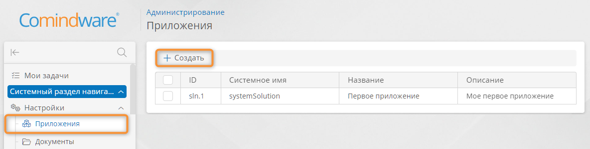_

3. Введите наглядное название приложения, например _«Управление автопарком»_. После заполнения имени поле «**Системное имя**» заполнится автоматически, при желании вы можете ввести собственное системное имя.

    

4. Нажмите кнопку «**Сохранить**».

    _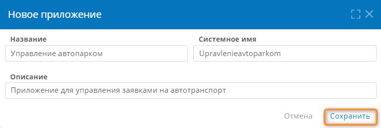_

5. Дважды нажмите строку созданного приложения в списке.
6. Отобразится страница «**Администрирование**» приложения.

    _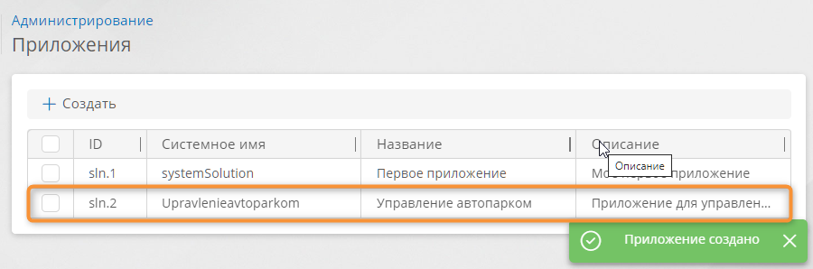_

## Создание шаблона записи

Определим данные заявки на автомобиль, которые необходимо хранить в **шаблоне записи**.

Создадим шаблон записи для заявки на автомобиль.

1. На странице «**Администрирование**» приложения _«Управление автопарком»_. выберите пункт «**Шаблоны**» <i class="fa-light fa-briefcase "></i>.

    __

2. Отобразится список всех шаблонов приложения.
3. Выберите вкладку «**Шаблоны записей**».
4. Нажмите кнопку «**Создать**».

    _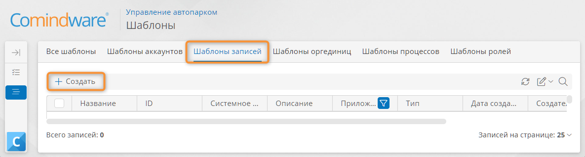_

5. Отобразится окно «**Новый шаблон**».
6. В поле «**Название**» введите наглядное наименование шаблона — _«Заявки на автомобили»_.
7. **Системное имя** будет заполнено автоматически.
8. В поле «**Тип шаблона**» должно быть автоматически выбрано значение «**Шаблон записи**».
9. Остальные поля оставьте без изменений.
10. Нажмите кнопку «**Создать**».

    __

## Создание атрибутов шаблона записи

Добавим атрибуты заявки на автомобиль.





1. Выберите вкладку «**Атрибуты**».
2. Нажмите кнопку «**Создать**».

    _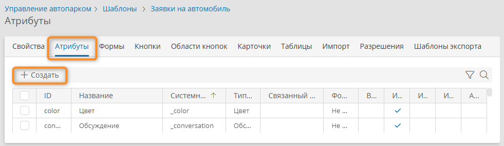_

3. Отобразится окно «**Новый шаблон**».
4. Выберите **тип данных** «**Текст**».
5. Введите **название** _«Место подачи»_.
6. **Системное имя** будет заполнено автоматически.
7. Остальные поля оставьте без изменений.
8. Нажмите кнопку «**Сохранить**».

    __

9. Аналогично создайте следующие атрибуты:

    | Тип данных       | Название       |
    | ---------------- | -------------- |
    | **Дата и время** | _Время подачи_ |
    | **Текст**        | _Маршрут_      |
    | **Число**        | _Пассажиры_    |

## Создание формы для просмотра и ввода данных

Теперь настроим экранную форму для просмотра и ввода данных заявки на автомобиль.

1. На странице шаблона записи _«Заявки на автомобили»_ выберите вкладку «**Формы**».

    !!! note "Основная форма шаблона"

        При создании шаблона записи автоматически создаётся пустая **основная форма**, в которой по умолчанию открываются записи шаблона.
       
        Для шаблона записи _«Заявки на автомобили»_ была создана форма _«Заявки на автомобили — Основная форма»_.

2. В списке форм дважды нажмите пункт _«Заявки на автомобили — Основная форма»_.

    __

3. Отобразится **конструктор формы**:

    

4. Перетащите на макет формы элемент «**Область**» с панели элементов.
5. Перетащите на макет формы атрибут _«Время подачи»_ с панели элементов.

    _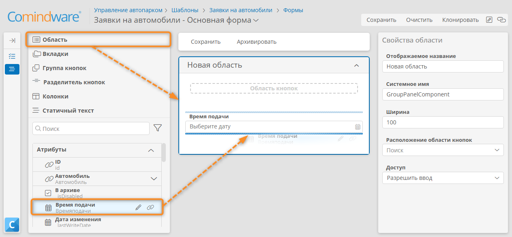_

6. Аналогичным образом перетащите на макет формы атрибуты _«Место подачи», «Маршрут», «Пассажиры»_.

    !!! warning "Бизнес-логика"

        В поле _«Время подачи» Заказчик_ должен вводить дату и время. Но по умолчанию для этого атрибута выбран **формат отображения** только даты. Изменим формат отображения атрибута.

7. На панели элементов щелкните значок «**Редактировать**» <i class="fa-light fa-pencil"></i> у атрибута _«Время подачи»_.

    __

8. Отобразится окно свойств атрибута.
9. Выберите **формат отображения**, включающий время, например «**4 сент. 1986 г. 07:30**».
10. Нажмите кнопку «**Сохранить**».

    __

### Назначение обязательных для заполнения полей

1. Выберите на форме поле _«Время подачи»_.
2. В поле «**Доступ**» на панели свойств поля выберите режим «**Требовать ввод**».

    _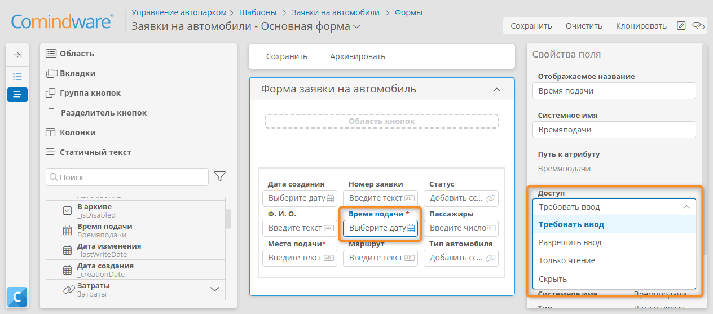_

3. Аналогично сделайте обязательным поле _«Место подачи»_.

    

4. Перетащите на форму элемент «**Колонки**» с панели элементов.
5. Перетащите поля _«Время подачи»_ и _«Место подачи»_ с макета формы соответственно в левый и правый столбцы элемента «**Колонки**».

    _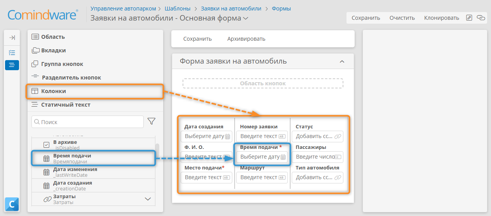_

6. Выберите заголовок **новой области** и с помощью панели свойств присвойте её наглядное **отображаемое название**: _Форма заявки на автомобиль_.
7. Сохраните форму, нажав кнопку «**Сохранить**» в конструкторе форм.

    _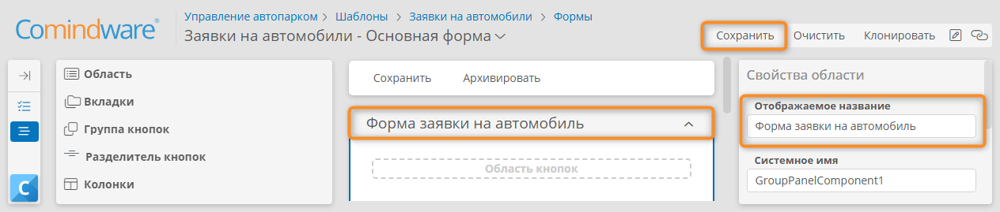_

## Тестирование: ввод и редактирование заявок

Мы создали форму для заявки на автомобиль. Теперь мы протестируем её от лица _Заказчика_.

1. Нажмите кнопку «**Настроить шаблон**» <i class="fa-light fa-pen-square"></i>.

    _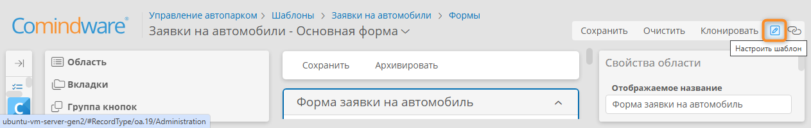_

2. Нажмите кнопку «**Перейти к экземплярам**».

    __

3. Отобразится список записей шаблона.
4. Нажмите кнопку «**Создать**», чтобы оформить новую заявку на автомобиль — запись в шаблоне.

    _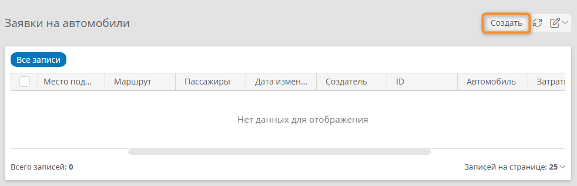_

5. Откроется _форма заявки на автомобиль_.
6. Заполните все поля и нажмите кнопку «**Сохранить**».

    __

7. Нажмите ссылку «**Заявки на автомобили**» над формой, чтобы вернуться к списку заявок.

    __

8. Создайте несколько заявок на автомобиль таким же образом.
9. Созданные записи будут отображаться в списке.
10. Двойным нажатием в списке записей откройте созданную запись, измените данные заявки и сохраните её.

    _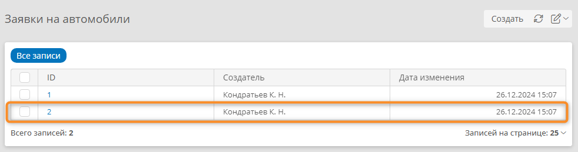_

## Доработка формы: добавление поля согласования заявки секретарем

Созданную заявку должен рассмотреть _Секретарь_, но в шаблоне записи _«Заявки на автомобили»_ не хватает атрибута для результата рассмотрения заявки. Добавим этот атрибут.

1. Перейдите к настройке шаблона записи. Для этого нажмите кнопку «**Мои настройки**» <i class=" fa-light fa-edit ">‌</i> на странице «**Все записи**» и выберите пункт «**Настроить шаблон**».

    __

2. На странице шаблона записи выберите вкладку «**Атрибуты**».
3. Нажмите кнопку «**Создать**».

    __

4. Отобразится окно «**Новый атрибут**».
5. Введите **название** _«Заявка одобрена»_ и выберите **тип данных** «**Логический**».
6. Нажмите кнопку «**Сохранить**».

    __

## Настройка таблицы со списком записей

В шаблоне записи по умолчанию предусмотрена таблица «**Все записи**», которая показывает список заявок и системные атрибуты: **ID**, **Создатель**,  **Дата создания**, **В архиве**, **Дата изменения**.

Список заявок на автомобили в таблице «**Все записи**» не информативен, так как не содержит необходимых данных о заявке. Доработаем этот список.

1. Перейдите на вкладку «**Таблицы**» шаблона записи и дважды нажмите строку «**Все записи**».

    _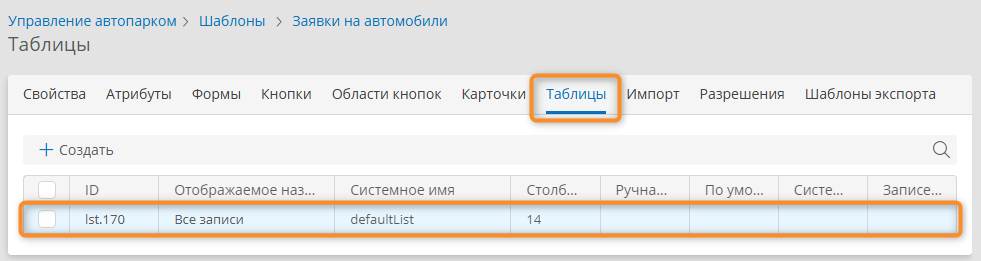_

2. Отобразится конструктор таблицы, который позволяет настроить набор и порядок отображения столбцов.

3. Для начала удалим столбцы, которые пользователю не интересны.
4. Выберите элемент «**ID**» в макете таблицы и перетащите его за пределы макета, например на панель элементов.
5. Таким же образом уберите из таблицы столбцы «**Дата создания**», «**В архиве**» и «**Используется в процессе**».
6. Оставьте в таблице столбцы «**Создатель**» и «**Дата изменения**».

    __

7. Теперь добавим в таблицу необходимые столбцы.
8. Перетащите следующие атрибуты с панели элементов на макет таблицы: _«Время подачи», «Место подачи», «Маршрут», «Пассажиры»_.

    !!! note "Примечание"

        Последовательность, в которой элементы расположены в конструкторе таблицы, определяет последовательность столбцов при её отображении. То есть элемент, который расположен вверху в конструкторе таблицы, отобразится первым (слева) в таблице.

9. Нажмите кнопку «**Сохранить**».
10. Будут сохранены параметры отображения таблицы по умолчанию для всех пользователей.
11. В меню <i class="fa-light fa-edit">‌</i> выберите пункт «**Настроить шаблон**».

    _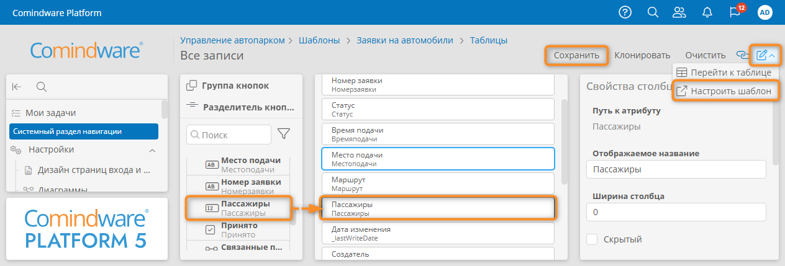_

12. Отобразится вкладка «**Свойства**» шаблона.
13. Нажмите кнопку «**Перейти к экземплярам**», чтобы открыть список заявок в виде таблицы с настроенными столбцами.

    __

## Поиск и фильтрация записей в таблице

Используем дополнительные настройки отображения записей в таблице — отфильтруем и отсортируем записи в нужном нам порядке, затем настроим группировку и подсчет итогов.

### Настройка параметров фильтрации, сортировки и группировки записей списка для текущего пользователя

!!! note "Примечание"

    - В этом параграфе представлены инструкции по настройке параметров отображения столбцов таблицы для **текущего пользователя**. Эти настройки хранятся в платформе индивидуально для каждого пользователя.
    - Помимо этого, в конструкторе таблицы можно настроить параметры отображения столбцов, которые будут использоваться **для всех пользователей по умолчанию**. См. _«[Настройка и сохранение параметров сортировки, группировки, подсчета итогов и фильтрации данных в таблице для всех пользователей](#настройка-параметров-сортировки-группировки-подсчета-итогов-и-фильтрации-данных-в-таблице-для-всех-пользователей)»_.

#### Сортировка записи

Отсортируем заявки на автомобили по времени подачи.

1. Нажмите  заголовок столбца _«Время подачи»_, чтобы отсортировать данные по этому столбцу:

    - по возрастанию;
    - по убыванию;
    - по умолчанию.

    Порядок сортировки обозначается стрелкой вниз (по убыванию), стрелкой вверх (по возрастанию) или отсутствием стрелки (по умолчанию) в заголовке столбца.

    _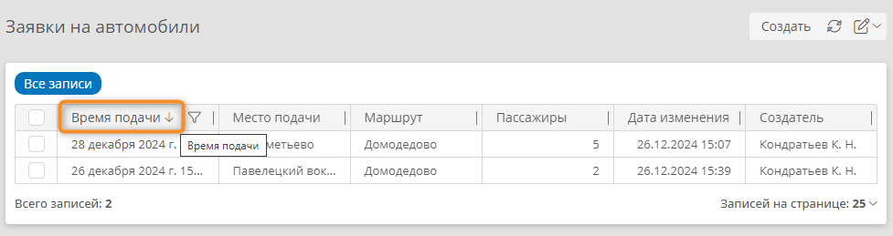_

#### Фильтр записей

Для отображения записей, содержащих определённое значение, можно использовать фильтр «**Равно**» или «**Содержит строку**».

1. Нажмите значок фильтра <i class="fa-light fa-filter"></i> в столбце _«Маршрут»_.
2. В раскрывшемся меню установите флажок «**Фильтровать данные**» и выберите тип фильтра «**Начинается с**» или «**Содержит строку**».
3. Введите искомый текст для фильтра в поле «**Введите текст**», например первые буквы названия маршрута любой заявки.
4. Нажмите кнопку «**Сохранить**».

    __

5. В списке отобразятся записи, соответствующие указанному фильтру.
6. Чтобы сбросить фильтр записей, нажмите значок фильтра <i class="fa-light fa-filter"></i> в столбце _«Маршрут»_, снимите флажок «**Фильтровать данные**» и нажмите кнопку «**Сохранить**».

    _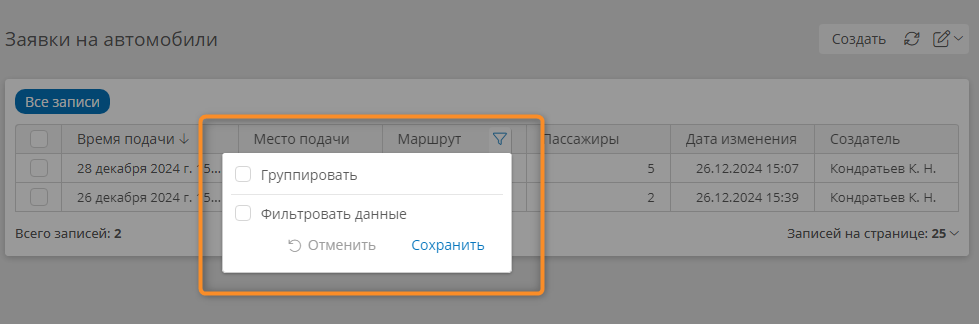_

#### Группировка записей

Сгруппируем заявки на автомобиль с одинаковым маршрутом.

1. Нажмите значок фильтра <i class="fa-light fa-filter"></i> в столбце _«Маршрут»_.
2. В раскрывшемся меню установите флажок «**Группировать**» и нажмите кнопку «**Сохранить**».

    _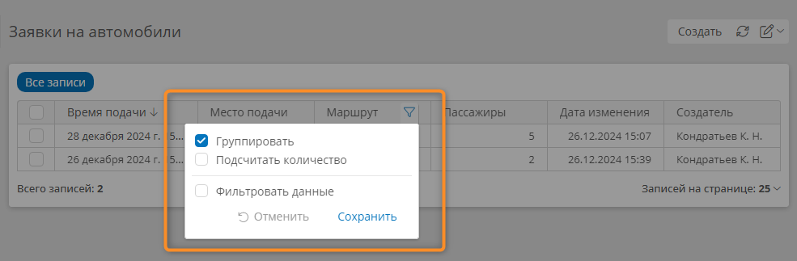_

#### Скрытие столбца

Скроем столбец «**Дата изменения**».

1. Нажмите кнопку <i class=" fa-light fa-edit ">‌</i> над таблицей
2. В раскрывшемся меню выберите пункт «**Настроить внешний вид**».

    __

3. Отобразится страница настройки внешнего вида таблицы.
4. Снимите флажок «**Дата изменения**», чтобы скрыть из таблицы этот столбец.
5. Нажмите кнопку «**Сохранить**».
6. Чтобы восстановить исходную конфигурацию отображения таблицы, нажмите кнопку «**Сбросить**».

    _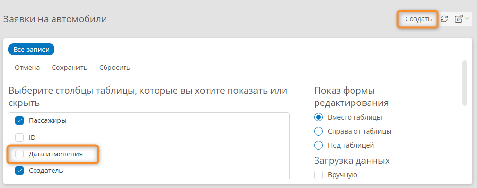_

### Настройка параметров сортировки, группировки, подсчета итогов и фильтрации данных в таблице для всех пользователей

!!! note "Примечание"

    - В этом параграфе представлены инструкции по настройке параметров отображения столбцов таблицы, которые будут использоваться  **для всех пользователей по умолчанию**.
    - Кроме того, каждый пользователь может настроить отображение столбцов индивидуально в соответствии со своими потребностями. См. параграф _«[Настройка параметров фильтрации, сортировки и группировки записей списка для текущего пользователя](#настройка-параметров-фильтрации-сортировки-и-группировки-записей-списка-для-текущего-пользователя)»_.

1. Нажмите кнопку <i class=" fa-light fa-edit ">‌</i> и в раскрывшемся меню выберите пункт «**Настроить таблицу**».
2. Отобразится конструктор таблицы.

    __

3. Выберите вкладку «**Дополнительные**» в панели «**Свойства таблицы**».
4. Перетащите атрибуты из макета таблицы в области «**Сортировка**», «**Группировка**» и «**Фильтрация**».
5. Настройте параметры сортировки, группировки и фильтрации данных в таблице для всех пользователей.
6. Нажмите кнопку «**Сохранить**».

    _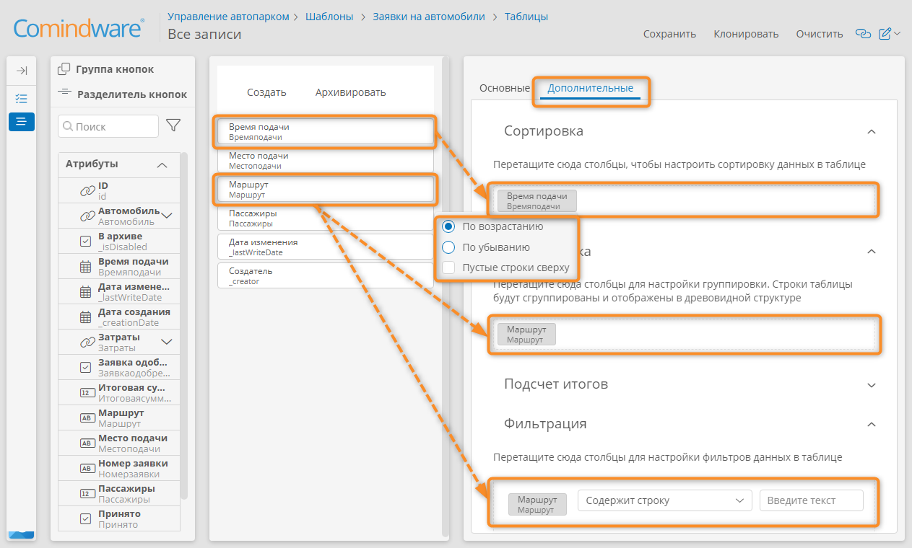_

## Результаты

Вы создали свой первый шаблон записи (реестр данных), настроили форму, научились её заполнять и настроили таблицу со списком записей.

В [следующем уроке][lesson_3] вы узнаете, как спроектировать и запустить бизнес-процесс.


