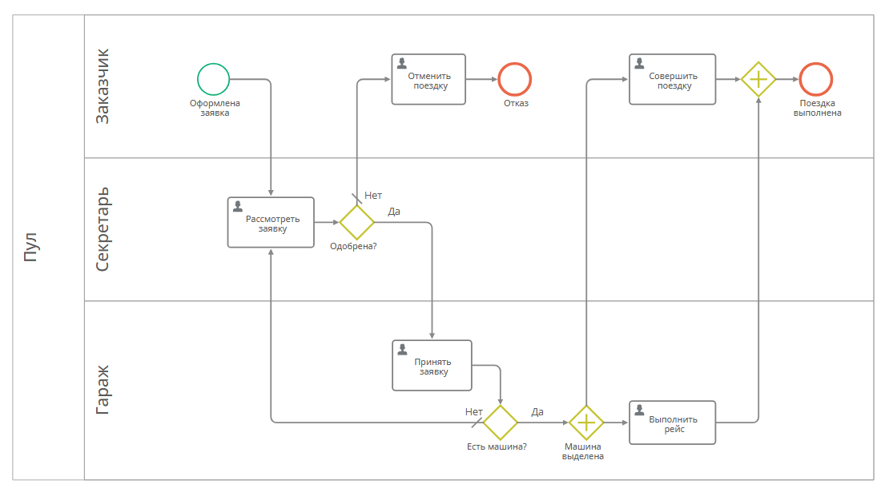

# Урок 3. Мой первый бизнес-процесс {: #lesson_3 }

## Введение

Усовершенствуем приложение, созданное в [предыдущем уроке][lesson_2], — добавим автоматизированный процесс заказа корпоративного автотранспорта со следующей бизнес-логикой:

- _Заказчик_ создает заявку на автомобиль.
- Заявка поступает на рассмотрение _Секретарю_.
- _Секретарь_ одобряет либо отклоняет заявку.
- Одобренная заявка поступает на рассмотрение _Сотруднику гаража_.
- _Сотрудник гаража_ принимает либо отклоняет заявку в зависимости от наличия автомобиля в гараже.
- Если _Сотрудник гаража_ принял заявку, _Заказчику_ поступает уведомление об этом, а _Водитель_ выполняет рейс.
- Если _Секретарь_ и _Сотрудник гаража_ отклоняют заявку, _Заказчику_ поступает уведомление об этом, и процесс завершается.

**Предусловия:** пройден [Урок 2. Мой первый реестр данных][lesson_2].

**Расчётная продолжительность:** 20 мин.



!!! question "Определения"

    

## Создание шаблона процесса

Настроим шаблона процесса заказа автотранспорта.

1. На панели навигации слева выберите пункты «**Настройки**» — «**Шаблоны**».
2. Перейдите на вкладку «**Шаблоны процессов**».
3. Нажмите кнопку «**Создать**».
4. Введите название шаблона _«Заказ автотранспорта»_.
5. Укажите приложение _«Управление автопарком»._
6. В поле «**Связанный шаблон**» выберите шаблон _«Заявки на автомобили»_.
7. Нажмите кнопку «**Создать**».

__

## Построение диаграммы бизнес-процесса

!!! note "Примечание"

    В **{{ productName }}** для построения **диаграмм бизнес-процесса** используется **нотация BPMN 2.0**.

    Нотация BPMN проста в понимании и часто применяется в бизнесе. Однозначная интерпретация диаграмм BPMN обеспечивает одинаковое понимание процесса бизнесом, аналитиками и ИТ-специалистами.

1. Перейдите на вкладку «**Диаграмма**».
2. Отобразится конструктор диаграммы бизнес-процесса.

    __

    !!! question "Конструктор диаграммы процесса"

        Конструктор диаграммы процесса состоит из трех частей, показанных на иллюстрации.

        **(1)** **Панель элементов**, которые можно перетащить на диаграмму:

        - **Действия** — задачи и подпроцессы:

            - **задачи** — **пользовательские** (выполнение действий данных участником процесса через форму задачи) и автоматические (выполнение сценария, вызов сервиса);
            - **подпроцессы** — **вызов процесса** и **встроенный подпроцесс**;

        - **События** — **начальное, промежуточное и конечное**;
        - **Развилки** — «**или/или**», «**и**» (параллельная);
        - **Общие элементы** — **дорожка**, **поток управления**, **комментарий**.

        **(2)** **Диаграмма** бизнес-процесса.

        **(3)** Кнопки **Выбрать версию**, **Очистить**, **Восстановить**, **Опубликовать**, **Проверить**, **Экспортировать**.

3. Добавим на диаграмму дорожки.

    !!! question "Дорожка"

        **Дорожка** в BPMN представляет участников процесса. Их можно настроить произвольным образом по усмотрению проектировщика процесса.
        
        Обычно дорожки представляют клиента, отдел, должность, роль или команду. Например, в нашем процессе _Заказчик_ — это роль (_Заказчик_ может быть из любого отдела), _Гараж_ — отдел, а _Секретарь_ — должность.

4. Перетащите с панели элементов три дорожки на диаграмму процесса. Элемент «**Дорожка**» расположен в группе «**Общие элементы**».

    __

5. Присвойте дорожкам названия: _Заказчик, Секретарь, Гараж._
6. Чтобы переименовать дорожку, выберите её и в раскрывающемся меню элемента нажмите кнопку «**Свойства**» <i class="fa-light fa-gear"></i>.

    __

7. В отобразившемся окне «**Свойства дорожки**» введите новое название и нажмите кнопку «**Сохранить**».

    __

8. Удалите конечное событие. Для этого выберите его и в меню элемента нажмите кнопку «**Удалить**» <i class="fa-light fa-trash-can"></i>.

    __

9. Перетащите элемент «**Пользовательская задача**» из раздела «**Действия**» с левой панели на дорожку _«Секретарь»_.

    !!! question "Пользовательская задача"

        **Пользовательскую задачу** выполняет человек. При переходе процесса на этот элемент задача автоматически назначается одному или нескольким исполнителям.

10. Присвойте задаче название _«Рассмотреть заявку»_. Для этого дважды нажмите название задачи.
11. Присоедините **поток управления** от начального события к пользовательской задаче _«Рассмотреть заявку»._
12. Перетащите элемент «**Развилка** «**или/или**» на диаграмму и соедините его с задачей _«Рассмотреть заявку»_.

    !!! question "Развилка «или/или»"

        **Развилка «или/или»** определяет альтернативные потоки процесса, из которых может быть выбран только один.
        
        Для каждого потока (стрелки), выходящего из развилки, указывается логическое условие.

        Процесс следует первому потоку, для которого условие возвращает `true`.
        
        Кроме того, можно выбрать поток «**иначе**» (по умолчанию), по которому процесс пойдет в том случае, если ни одно из условий на других потоках не выполнено.
        
13. Присоедините к развилке два потока управления.
14. Присвойте развилке название _«Одобрена?»_. Для этого дважды нажмите развилку и введите ее название или нажмите кнопку «**Свойства**» <i class="fa-light fa-gear"></i> в меню элемента.

    __

    !!! warning "Бизнес-логика"

        Если _Секретарь_ отклоняет заявку, то _Заказчик_ получает уведомление об этом, после чего процесс завершается. 
        
        Если _Секретарь_ одобряет заявку, то далее её обрабатывает _сотрудник Гаража_. 
        
        Реализуем на диаграмме эту бизнес-логику.

15. К развилке _«Одобрена?»_ присоедините потоками управления две новые пользовательские задачи:

    - _«Отменить поездку»_ на дорожке _«Заказчик»_;
    - _«Принять заявку»_ на дорожке _«Гараж»_.

16. Выберите развилку и в меню элемента нажмите кнопку «**Свойства**» <i class="fa-light fa-gear"></i>.
17. Отобразится окно «**Свойства развилки «или/или**».
18. На вкладке «**Дополнительные**» укажите названия исходящих потоков — _«Да»_ и _«Нет»_. Для этого дважды нажмите соответствующие поля.
19. Сохраните настроенные свойства развилки.

    __

20. К задаче _«Отменить поездку»_ присоедините новое конечное событие.
21. Присвойте конечному событию название _«Отказ»_.

    !!! question "События"

        **События** в BPMN можно рассматривать как этапы процесса — старт, промежуточные вехи, варианты завершения.
        
        - **Простое начальное событие** может быть только одно, а начальных событий других типов — несколько.
        - Промежуточных событий может быть несколько согласно бизнес-логике.
        - Конечных событий может быть несколько для различных результатов завершения процесса.

    __

    !!! warning "Бизнес-логика"

        После принятия заявки _Сотрудник гаража_ проверяет наличие автомобиля для выполнения заявки. Если автомобиль отсутствует, заявка возвращается _Секретарю_.

22. От задачи _«Принять заявку»_ добавьте элемент «**Развилка** «**или/или**».
23. Добавьте поток управления от развилки к задаче _«Рассмотреть заявку»._
24. Задайте для развилки название _«Есть машина?»._

    __

    !!! warning "Бизнес-логика"

        При наличии машины _Заказчик_ получит уведомление _«Совершить поездку»_, а _Водитель_ приступит к выполнению рейса.

25. Добавьте элемент «**Развилка** «**и**» от развилки _«Есть машина?»_.

    !!! question "Развилка «и»"

        **Развилка «и»** (параллельная) используется для разделения процесса на несколько потоков, которые будут выполняться одновременно.

26. От **развилки «и»** добавьте две пользовательских задачи:

    - _«Совершить поездку»_ для _Заказчика_;
    - _«Выполнить рейс»_ для сотрудника _Гаража_.

27. Укажите названия для исходящих потоков от развилки _«Есть машина?»: «Да»_ и _«Нет»_.
28. Добавьте ещё одну **развилку «и»** и соедините с ней задачи _«Совершить поездку»_ и _«Выполнить рейс»_.
29. Добавьте конечное событие и назовите его _«Поездка выполнена»._
30. В итоге должна получиться следующая диаграмма:

    __

!!! warning "Логика бизнес-процесса"

    Чтобы закрепить пройденный материал, обобщим диаграмму процесса заказа автотранспорта.

    1. _Заказчик_ подаёт заявку.
    2. _Секретарь_ рассматривает заявку:
        - если _Секретарь_ одобрил заявку, то выполняется шаг 4;
        - если _Секретарь_ отклонил заявку, то выполняется шаг 3.
    3. _Заказчик_ получает уведомление о том, что заявка отклонена и следует отменить поездку. Процесс заказа автотранспорта завершается отказом.
    4. _Сотрудник гаража_ рассматривает заявку:
        - в случае наличия машины он передает заявку на выполнение _Водителю_ и выполняется шаг 5;
        - в случае отсутствия машины заявка возвращается _Секретарю_ — на шаг 2.
    5. _Заказчик_ получает уведомление о том, что машина выделена и следует совершить поездку, а _Водитель_ приступает к выполнению рейса.
    6. Процесс завершается успехом.

## Настройка форм пользовательских задач

### Стартовая форма Заказчика

Настроим **стартовую форму**, которую будет заполнять _Заказчик_ при запуске процесса.

1. Выберите на диаграмме «**Начальное событие**» и в раскрывшемся меню элемента нажмите кнопку «**Стартовая форма**» <i class="fa-light fa-window-maximize"></i>.

    __

2. Откроется конструктор стартовой формы.
3. Для формы задачи используем созданную ранее форму согласования заявки.
4. Перетащите с панели элементов форму _«Заявки на автомобили — Основная форма»_ на макет формы.
5. Сохраните форму.
6. Вернитесь к диаграмме процесса, нажав кнопку «**Назад**» в браузере.

    __

## Форма задачи Секретаря «Рассмотреть заявку»

Настроим форму пользовательской задачи, которую будет заполнять исполнитель — _Секретарь_.

1. Выберите задачу _«Рассмотреть заявку»_ и в меню элемента нажмите кнопку «**Форма**» <i class="fa-light fa-newspaper"></i>.

    __

2. Отобразится конструктор формы задачи.
3. Разверните элемент _«Заявки на автомобили»_ на панели элементов слева.
4. Перетащите форму _«Заявки на автомобили — Основная форма»_ на макет формы.

    !!! warning "Бизнес-логика"

        _Секретарь_ не должен редактировать поля формы заявки на автомобиль от _Заказчика_, поэтому изменим режим доступа к вложенной форме.

5. Выберите добавленную форму заявки и на панели свойств укажите режим **доступа** «**Только чтение**».
6. Перетащите на макет формы под форму заявки на автомобиль элемент «**Область**» и присвойте ей название _«Решение»_ с помощью панели свойств.
7. Перетащите в область _«Решение»_ атрибут _«Заявка одобрена»_ из панели элементов.
8. Сохраните форму и вернитесь к диаграмме процесса, нажав кнопку «**Назад**» в браузере.

    __

### Форма задачи Сотрудника гаража «Принять заявку»

Настроим форму задачи, которую будет заполнять _Сотрудник гаража_.

1. Выберите задачу _«Принять заявку»_ на диаграмме процесса и в меню элемента нажмите кнопку «**Форма**» <i class="fa-light fa-newspaper"></i>.
2. Отобразится конструктор формы.
3. Перетащите форму _«Заявки на автомобили — Основная форма»_ на макет формы.
4. Укажите для дочерней формы режим **доступа** « **Только чтение**», чтобы сотрудник гаража не мог редактировать заявку.

    !!! warning "Бизнес-логика"

        Сотрудник _Гаража_ должен принять или отклонить заявку в зависимости от наличия автомобиля в гараже.

        Для этого добавим **логический** атрибут.

        **{{ productName }}** позволяет добавлять атрибуты на лету, непосредственно во время настройки формы или таблицы.

5. Чтобы добавить атрибут в этот шаблон записи, нажмите кнопку «**Добавить атрибут**» <i class="fa-light fa-plus"></i> рядом с пунктом _«Заявки на автомобили»_ в панели элементов.

    __

6. В отобразившемся окне свойств атрибута выберите **тип данных** «**Логический**» и укажите название _«Принято»_.
7. Нажмите кнопку «**Сохранить**».

    __

8. Перетащите на макет формы новую **область** и переименуйте её в _«Принятие заявки»_ с помощью панели свойств.
9. Перетащите созданный атрибут _«Принято»_ на область _«Принятие заявки»._
10. Выберите поле _«Принято»_ и на панели свойств укажите способ отображения «**Отображать как переключатель**».
11. Сохраните форму и вернитесь к диаграмме процесса с помощью кнопки «**Назад**» браузера.

    __

### Форма задачи Заказчика «Отменить поездку»

!!! warning "Бизнес-логика"

    Если заявка отклонена, _Заказчик_ должен быть проинформирован об этом.
    
    Форма пользовательской задачи в этом случае должна содержать только текст _«Заявка отклонена»_ и данные заявки.

    При этом _Заказчик_ не должен менять какие-либо данные в заявке.

1. Выберите на диаграмме процесса задачу _«Отменить поездку»_ и в меню элемента нажмите кнопку «**Форма**» <i class="fa-light fa-newspaper"></i>.
2. Отобразится конструктор формы задачи.
3. Перетащите на макет формы новую **область** и переименуйте её в _«Заявка отклонена»_ с помощью панели свойств.
4. На панели элементов разверните элемент _«Заявки на автомобили»_.
5. Перетащите форму _«Заявки на автомобили — Основная форма»_ под область _«Заявка отклонена»._
6. На панели свойств формы укажите режим **доступа** «**Только чтение**».
7. Сохраните форму и вернитесь к диаграмме процесса.

    __

### Форма задачи Заказчика «Совершить поездку»

Настройте форму для задачи, приходящей _Заказчику_, когда заявка одобрена.

1. Перейдите к настройке формы задачи _«Совершить поездку»_.
2. Поместите на форму область _«Совершить поездку»_ и вложенную форму _«Заявки на автомобили — Основная форма»_.
3. Установите для вложенной формы режим **доступа** «**Только для чтения**».
4. Сохраните форму и вернитесь к диаграмме процесса.

    __

### Форма задачи Водителя «Выполнить рейс»

1. Перейдите к настройке формы задачи _«Выполнить рейс»_.
2. Поместите на форму область _«Выполнить рейс»_ и вложенную форму _«Заявки на автомобили — Основная форма»_.
3. Установите для вложенный формы режим **доступа** «**Только для чтения**».
4. Сохраните форму и вернитесь к диаграмме процесса.

## Настройка развилок

Перейдём к настройке потоков управления после развилок. На диаграмме есть две развилки — _«Одобрена?»_ и _«Есть машина?»_.

### Развилка «Одобрена?»

!!! warning "Бизнес-логика"

    Поток, по которому процесс пойдёт после развилки _«Одобрена?»_, задаёт логический атрибут _«Заявка одобрена»_, значение которого устанавливает _Секретарь_ при рассмотрении заявки.

    Для управления ходом процесса определим условие для потока к задаче _«Принять заявку»_ на основе значения атрибута _«Заявка одобрена»_.

1. Выберите развилку _«Одобрена?»_ и в меню элемента нажмите кнопку «**Свойства**» <i class="fa-light fa-gear"></i>.
2. Откроется окно свойств развилки.

    __

3. На вкладке «**Дополнительные**» для потока к задаче _«Отменить поездку»_ установите флажок «**Поток** «**иначе**».

    __

    !!! question "Поток управления «иначе» от развилки «или/или»"

        **Поток управления «иначе»** (по умолчанию) — это поток из **развилки «или/или»**, по которому пойдет процесс в том случае, если условия на всех остальных потоках не выполняются (значение логического выражения — `false`).

4. Составим выражение для условия, при выполнении которого процесс пойдет дальше. Для этого нам потребуется системное имя атрибута _«Заявка одобрена»._
5. На вкладке «**Дополнительные**»  нажмите ячейку «**Условие**» в строке потока к задаче _«Принять заявку»_.
6. Отобразится компактный редактор выражения.

    __

7. При составлении выражения необходимо обратиться к системному имени атрибута.
8. Введите символ `$` и в отобразившемся раскрывающемся списке дважды нажмите системное имя атрибута `Заявкаодобрена`.

    !!! question "Ссылки на атрибуты в формулах"

        В формулах префикс `$` перед системным именем атрибута используется, чтобы обратиться атрибуту текущего объекта. 
        
        То есть формула `$Заявкаодобрена` возвращает значение атрибута _«Заявка одобрена»_ — `true` или `false` (ложь или истина).

9. Нажмите кнопку <i class="fa-light fa-check"></i>.
10. Сохраните поток управления.

    __

### Развилка «Есть машина?»

!!! warning "Бизнес-логика"

    Процесс должен перейти от развилки «Есть машина?» к **развилке «и»**, если _Сотрудник гаража_ установил для логического атрибута _«Принято»_  значение `true`. 

1. Выберите развилку _«Есть машина?»_ и в меню элемента нажмите кнопку «**Свойства**» <i class="fa-light fa-gear"></i>.
2. Перейдите на вкладку «**Дополнительные**».
3. Введите для потока _«Да»_ **формулу** `$Принято`.
4. Нажмите кнопку <i class="fa-light fa-check"></i>.

    __

5. Установите для потока к задаче _«Рассмотреть заявку»_ флажок «**Поток** «**иначе**».
6. Сохраните поток управления.

    __

## Настройка исполнителей задач

Укажем исполнителей для пользовательских.

### Задачи «Рассмотреть заявку», «Принять заявку» и «Выполнить рейс»

!!! tip "Совет"

    Для упрощения отладки процесса укажите исполнителем этих задач одного и того же пользователя, например свой аккаунт.

1. Выберите пользовательскую задачу _«Рассмотреть заявку»_ и в меню элемента нажмите кнопку «**Свойства**» <i class="fa-light fa-gear"></i>.

    __

2. На вкладке «**Дополнительные**» выберите исполнителя в раскрывающемся списке «**Исполнители**».
3. Введите заголовок задачи _«Заказ автотранспорта — Рассмотреть заявку»._

    __

4. Нажмите кнопку «**Сохранить**».
5. Аналогичным образом задайте **исполнителей** и **заголовки задач** _«Принять заявку» и «Выполнить рейс»_.

### Задачи «Отменить поездку» и «Совершить поездку»

Для задач _«Отменить поездку»_ и _«Совершить поездку»_ сделаем исполнителя вычисляемым — это должен быть пользователь, который инициировал процесс, то есть _Заказчик_.

!!! question "Системный атрибут «Создатель»"

    **Системный атрибут** «**Создатель**» (`_creator`) содержит ID аккаунта, который запустил экземпляр процесса.

1. Выберите задачу _«Отменить поездку»_ и в меню элемента нажмите кнопку «**Свойства**» <i class="fa-light fa-gear"></i>.
2. Отобразится окно «**Свойства пользовательской задачи**».
3. На вкладке «**Дополнительные**» в поле «**Исполнители**» выберите пункт «**Атрибут**».
4. Нажмите стрелку вниз в поле «**Исполнители**».
5. Выберите атрибут «**Создатель**» (`_creator`).
6. Введите **заголовок задачи** _«Заказ автотранспорта — Отменить поездку»_.
7. Сохраните пользовательскую задачу.

    __

8. Аналогичным образом назначьте исполнителем инициатора процесса и задайте заголовок задачи _«Совершить поездку»_.

## Проверка и публикация процесса

Вы настроили шаблон бизнес-процесса. Чтобы применить изменения и запустить процесс, его необходимо опубликовать.

Диаграмму бизнес-процесса рекомендуется публиковать каждый раз после внесения изменений.

Перед публикацией проверьте диаграмму, чтобы убедиться, что формулы верны и диаграмма соответствует нотации BPMN.

1. Нажмите кнопку «**Проверить**» в конструкторе диаграммы процесса.

    -Если обнаружены какие-либо ошибки, элементы с ошибками будут выделены красным цветом. Щёлкните восклицательный знак рядом с выделенным элементом, чтобы просмотреть сообщения об ошибках.
    -Если диаграмма не содержит ошибок, появится сообщение «**Ошибок нет**», после чего диаграмму можно публиковать.

2. Нажмите кнопку «**Опубликовать**».

__

## Тестирование: запуск процесса и «Мои задачи»

Вы настроили и опубликовали бизнес-процесс, теперь протестируйте его в роли пользователя.

1. Перейдите на вкладку «**Свойства**» шаблона процесса _«Заказ автотранспорта»_.
2. Нажмите кнопку «**Перейти к экземплярам**».

    __

3. В отобразившемся списке «**Все записи**» нажмите кнопку «**Создать**».
4. Отобразится стартовая форма процесса.
5. Заполните форму в роли _Заказчика_.
6. Нажмите кнопку «**Создать**».

    __

7. Запущенный экземпляр процесса отобразится в списке.
8. Проверьте наличие задачи _«Рассмотреть заявку»_, в которой исполнителем назначены вы сами.
9. Перейдите на страницу «**Мои задачи**» с помощью панели навигации слева.

    __

10. Отобразится список назначенных вам активных задач.
11. Откройте задачу, дважды нажав её в списке.

    __

12. Отобразится форма рассмотрения заявки на автомобиль.
13. Установите флажок _«Заявка одобрена»_, то есть одобрите заявку в роли _Секретаря_.
14. Нажмите кнопку «**Завершить задачу**».

    __

15. Откройте страницу «**Мои задачи**».
16. В списке появится задача _«Заказ автотранспорта — Принять заявку»_.
17. В поле _«Принято»_ выберите пункт _«Нет»_. Это означает, что _Сотрудник гаража_ не смог выделить автомобиль для заявки и вернул её _Секретарю_.
18. Завершите задачу.

    __

19. Вернитесь к списку своих задач.
20. В списке появится задача _«Заказ автотранспорта — Рассмотреть заявку»_.
21. Откройте задачу и снимите флажок _«Заявка одобрена»_, то есть отклоните заявку в роли _Секретаря_.
22. Завершите задачу.
23. Откройте страницу «**Мои задачи**».
24. В списке задач появится задача _«Заказ автотранспорта — Отменить поездку»_. Это означает, что ваша заявка на автомобиль отклонена и вам как _Заказчику_ пришло об этом уведомление.
25. Завершите задачу.
26. Бизнес-процесс будет завершён.

## Результаты

Поздравляем! Вы создали свой первый бизнес-процесс, настроили для него формы задач и протестировали запуск и исполнение задач процесса.

В [следующем уроке][lesson_4] вы узнаете, как отследить историю запущенного процесса, и настроите информационные страницы с диаграммами для просмотра статистики за период.


