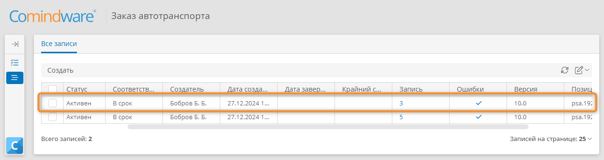
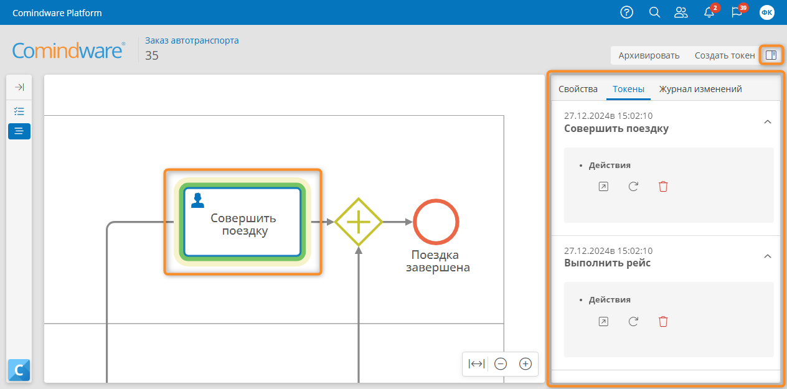
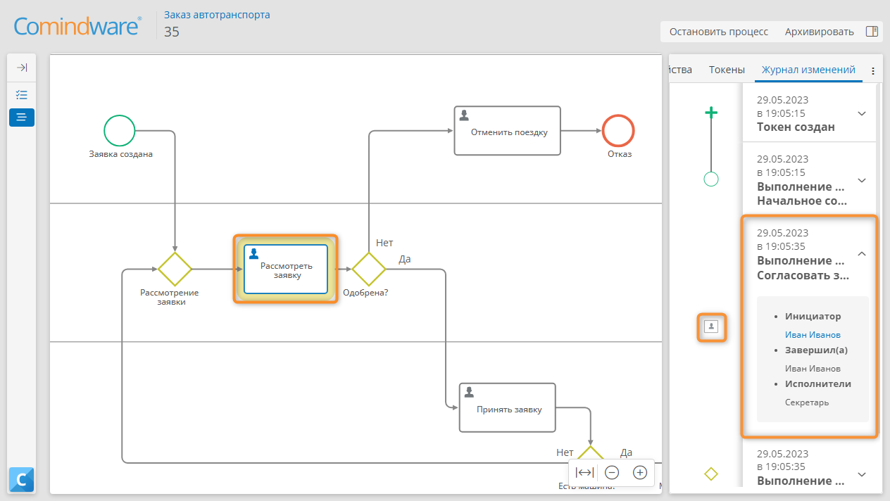
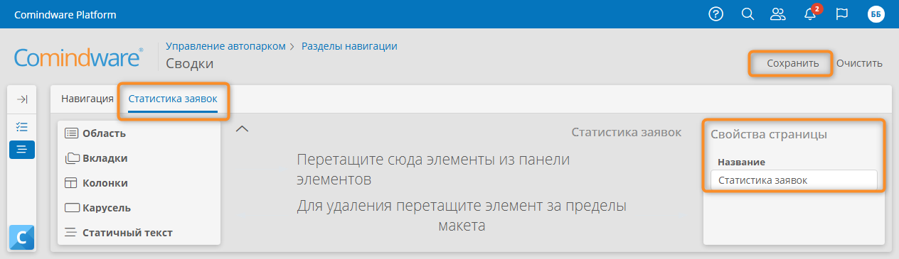
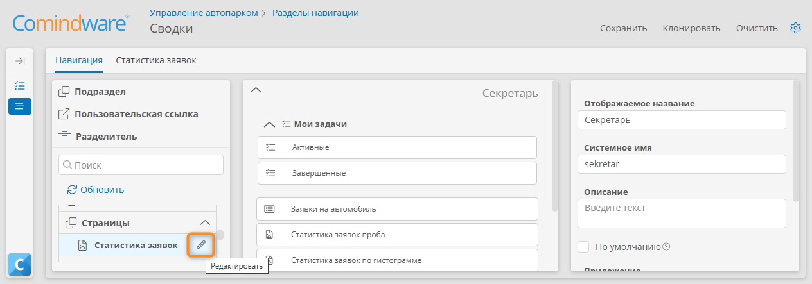
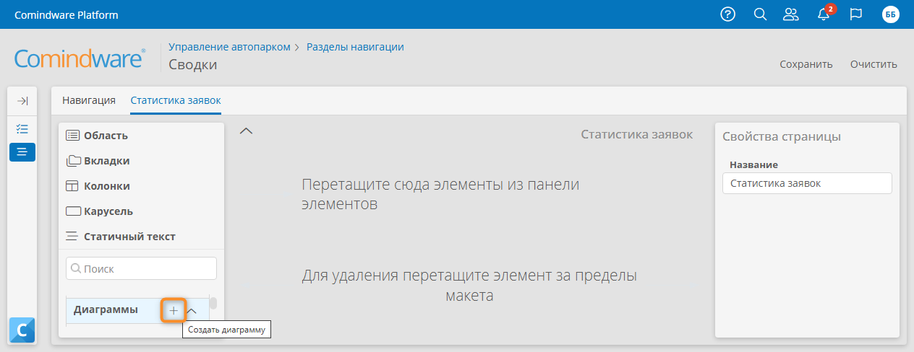
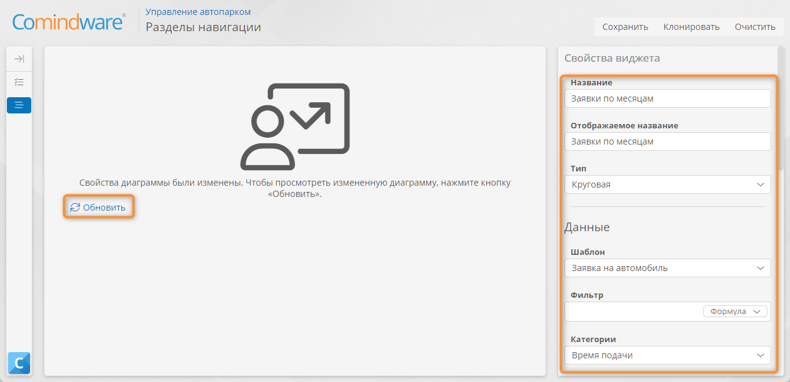
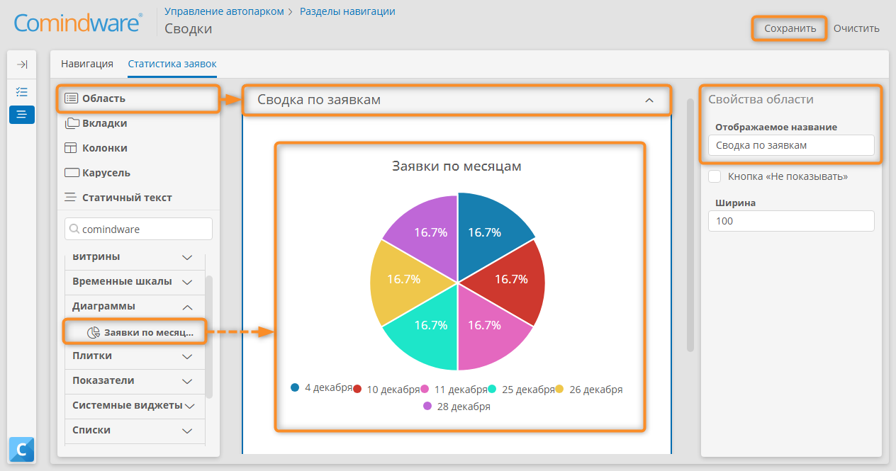
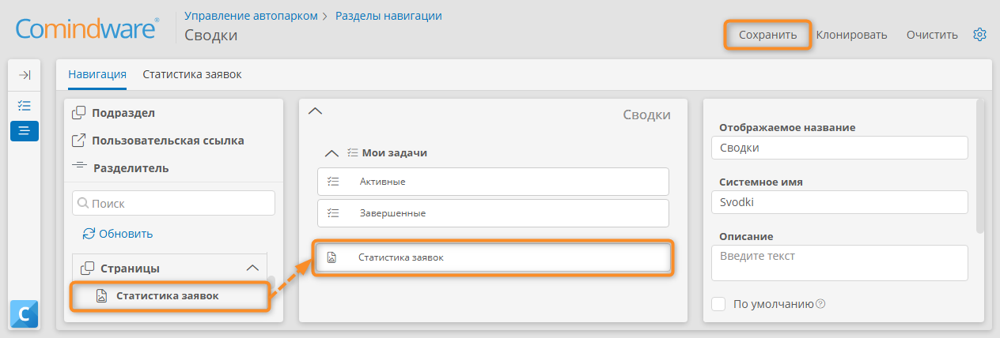

# Урок 4. Мониторинг и аналитика {: #lesson_4 }

## Введение

В ходе этого урока вы научитесь просматривать **историю выполнения процесса** и создавать **информационные страницы** (дашборды) с диаграммами для просмотра статистики за определённый период.

**Предусловия:** пройден _[урок 3 «Мой первый бизнес-процесс»][lesson_3]_.

**Расчётная продолжительность:** 55 мин.



## Определения {: .admonition-title #definitions}

**{{ productName }}** позволяет анализировать состояние запущенных и завершённых экземпляров бизнес-процессов.

- Доступна следующая информация об истории процесса:
    - Позиции **токенов** на диаграмме.
    - Путь выполнения процесса.
    - Цепочка событий для каждого элемента диаграммы процесса.
    - Информация о каждом элементе процесса (исполнитель задачи, срок выполнения и т. д.).
    - Ошибки, возникшие в ходе выполнения процесса.
--8<-- "process_diagram_token_definition.md"

## Мониторинг исполнения бизнес-процесса

Просмотрим историю экземпляра процесса _«Заказ автотранспорта»_.



1. В списке шаблонов откройте шаблон процесса _«Заказ автотранспорта»_, дважды нажав его.
2. Откройте список экземпляров процесса, нажав кнопку «**Перейти к экземплярам**» на вкладке «**Свойства**» шаблона процесса.
3. В списке выберите один из запущенных экземпляров процесса, дважды нажав его.

    __

4. Отобразится представление истории процесса, в котором активный элемент диаграммы будет выделен зелёным цветом.
5. Выберите задачу _«Совершить поездку»_ на диаграмме процесса.
6. На панели справа отобразится информация о её выполнении.

    __

7. Перейдите на вкладку «**Журнал изменений**» и разверните задачу _«Рассмотреть заявку»_ для просмотра информации о ней.
8. Задача _«Рассмотреть заявку»_ на диаграмме процесса будет выделена желтым цветом.
9. Аналогично выберите любой другой элемент диаграммы процесса для просмотра сведений о нём.

    __

## Настройка страницы с круговой диаграммой количества заказов

!!! question "Страницы"

    **{{ productName }}** позволяет создавать информационные страницы (дашборды) для мониторинга и анализа статистических данных за определённый период. Информационная страница может содержать диаграммы, списки, показатели и другие виджеты для визуализации бизнес-данных.

!!! warning "Бизнес-логика"

    Перед настройкой и использованием информационной страницы с диаграммой создайте данные для визуализации: создайте и выполните несколько заявок по бизнес-процессу, заполнив _время подачи_ автомобиля датами с разными месяцами.

Настроим информационную страницу с диаграммой, которая будет показывать количество заказов автомобилей по месяцам.

1. На панели навигации слева выберите пункт «**Настройки**» — «**Приложения**».
2. Откройте страницу администрирования приложения _«Управление автопарком»_, дважды нажав его в списке.
3. Выберите пункт «**Разделы навигации**» <i class="fa-light fa-list-dropdown"></i>.
4. В списке разделов навигации нажмите кнопку «**Создать**».
5. Отобразится конструктор раздела навигации.
6. На панели свойств раздела навигации укажите **отображаемое название** раздела навигации _«Сводки»_.
7. Сохраните раздел навигации.
8. Обновите страницу в браузере после сохранения раздела навигации, чтобы последующие шаги выполнялись корректно.
9. В панели элементов слева нажмите кнопку «**Создать страницу**» <i class="fa-light fa-plus"></i> рядом с пунктом «**Страницы**».

    __

10. Откроется вкладка «**Новая страница**».
11. В панели свойств укажите название страницы _«Статистика заявок»_.
12. Сохраните страницу.
13. Обновите страницу в браузере, чтобы последующие шаги выполнялись корректно. Если браузер выдаст предупреждение о возможной утрате несохранённых изменений, подтвердите обновление страниц.

    __

14. Выберите вкладку «**Навигация**».
15. Разверните раздел «**Страницы**» в панели элементов.
16. Нажмите кнопку «**Редактировать**» <i class="fa-light fa-pencil"></i> рядом с пунктом _«Статистика заявок»_ в панели элементов.

    __

17. Откроется вкладка «**Статистика заявок**».
18. Нажмите кнопку со значком «**Создать диаграмму**» <i class="fa-light fa-plus"></i> рядом с пунктом «**Диаграммы**» в панели элементов.

    __

19. Откроется конструктор диаграммы.
20. Настройте диаграмму с помощью панели «**Свойства виджета**»:

    - **Название:** _Заявки по месяцам;_
    - **Отображаемое название:** _Заявки по месяцам;_
    - **Тип**: **круговая диаграмма**;
    - **Шаблон:** _Заявки на автомобили_ — источник данных для диаграммы;
    - **Категории:** _Время подачи_ — атрибут, по значениям которого будут сгруппированы записи на диаграмме;
    - **Фильтр по дате**
        - **Атрибут**: **время подачи** —  атрибут типа «**Дата и время**», используемый для фильтрации записей на диаграмме.
        - **Периоды:** **ближайшие месяцы** — интервал, с которым будут сгруппированы записи на диаграмме;
        - **Период по умолчанию:** **текущий месяц** — период, записи за который будут отображаться на диаграмме по умолчанию.

21. Просмотрите и сохраните результирующую диаграмму.

    __

22. Нажмите в браузере кнопку «**Назад**», чтобы вернуться к странице _«Статистика заявок»_.
23. Перетащите новую **область** на макет страницы и переименуйте ее в _«Отчёты»_.
24. Перетащите диаграмму _«Заявки по месяцам»_ из панели элементов в область _«Отчёты»_.
25. Сохраните страницу _«Статистика заявок»_.

    __

26. Выберите вкладку «**Навигация**».
27. Перетащите страницу _«Статистика заявок»_ из панели элементов на макет раздела навигации.
28. Сохраните раздел навигации.

    __

## Результаты

Вы научились получать информацию об истории выполнения процессов и создавать информационные страницы для визуализации данных.

!!! note "Примечание"

    Созданный **раздел навигации** _«Сводки»_ мы впоследствии используем в [Уроке 8][lesson_8].

В [следующем уроке][lesson_5] вы познакомитесь с новым типом атрибутов — **Запись**, а также создадите справочник и мастер-данные.


