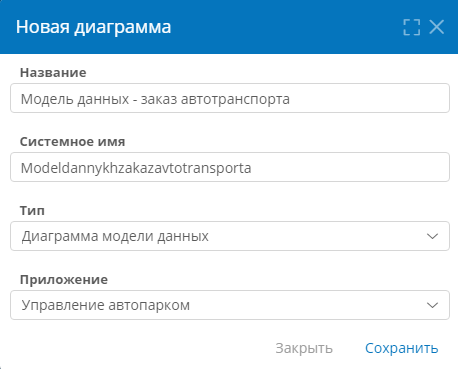
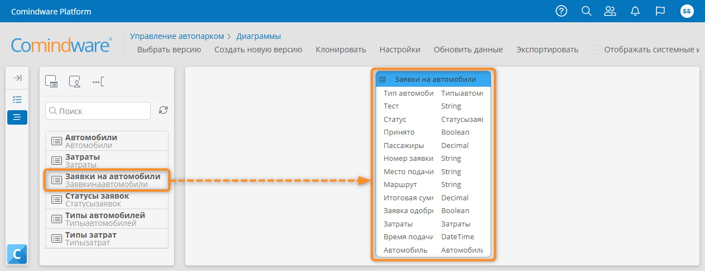
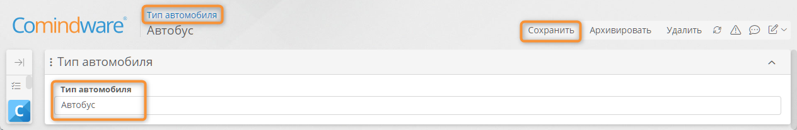
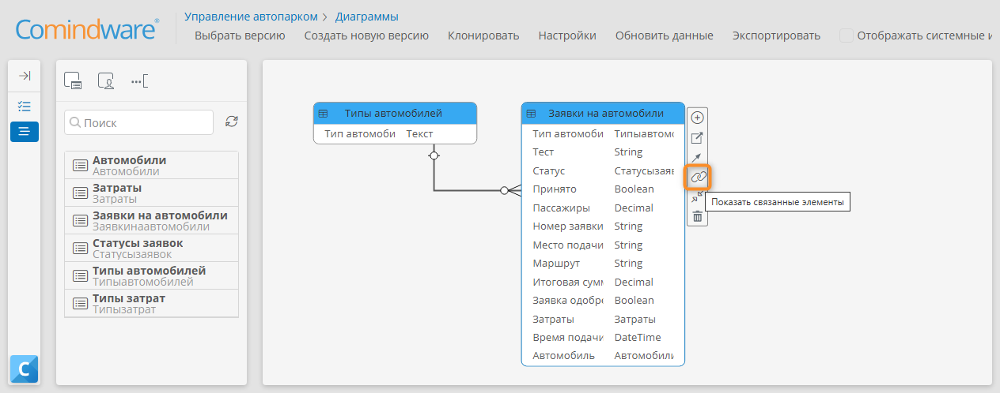
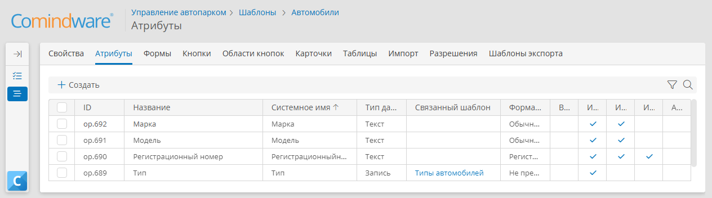
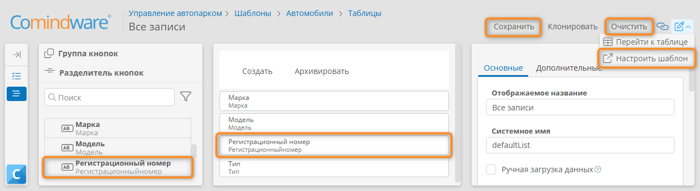
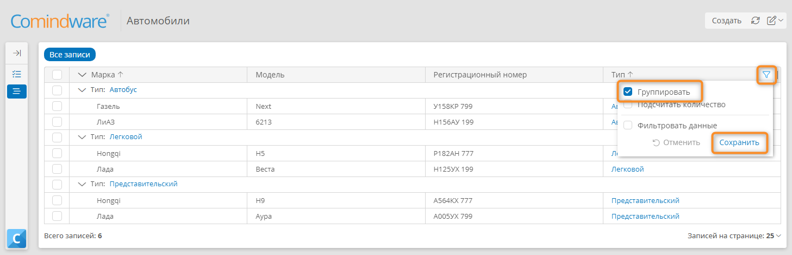
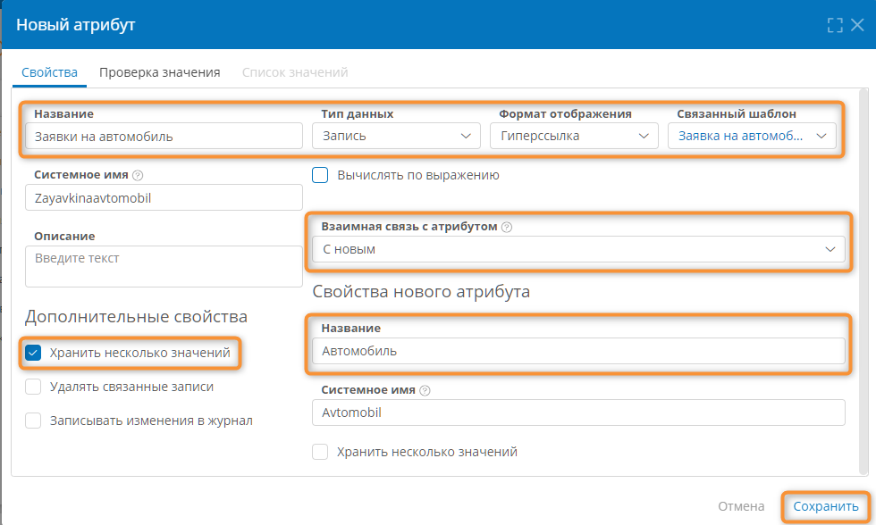
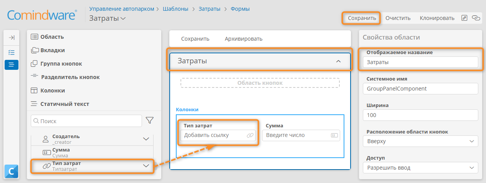
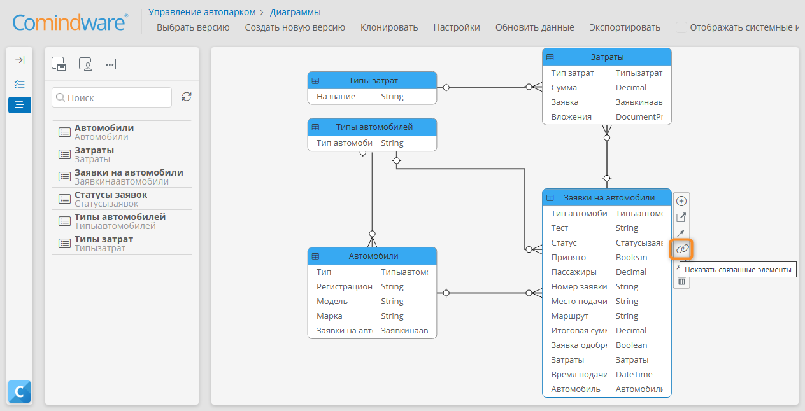

# Урок 5. Структуры данных {: #lesson_5 }



## Введение

В ходе этого урока вы научитесь использовать **диаграмму «сущность-связь»** для визуальной настройки **модели данных** приложения, создания шаблонов записей различных типов (для справочников, мастер-данных и транзакционных данных) и установления связей между ними.

**Предусловия:** пройден _[урок 2 «Мой первый реестр данных»][lesson_2]_.

**Расчётная продолжительность:** 70 мин.



## Определения {: .admonition-title #definitions}

- В **{{ productName }}** для визуализации и проектирования **модели данных** приложения используются **диаграммы «сущность-связь»** (ER-диаграммы).
- **Диаграмма модели данных** наглядно показывает шаблоны записей, их атрибуты и связи друг с другом.
- Непосредственно в ходе создания и редактирования диаграммы можно создавать и настраивать новые шаблоны записей (реестры данных) и добавлять атрибуты.
- Это позволяет настраивать приложение и при этом видеть его модель данных в целом.

## Создание диаграммы модели данных

1. На панели навигации слева выберите пункты «**Настройки**» — «**Диаграммы**».
2. Отобразится список диаграмм всех приложений.

    !!! note "Примечание"

        - По умолчанию список диаграмм содержит **диаграммы процессов** и **диаграммы классов**:
            - **диаграмма классов** создается автоматически для каждого приложения;
            - **диаграмма процесса** создается автоматически для каждого **шаблона процесса**.

3. Создайте диаграмму, нажав кнопку «**Создать**».
4. В отобразившемся окне настройте **новую диаграмму**:

    - **Название:** _Модель данных — заказ автотранспорта_
    - **Тип:**  **диаграмма модели данных**
    - **приложение**  _Управление автопарком_

5. Нажмите кнопку «**Сохранить**».

    __

6. Отобразится конструктор диаграммы модели данных.

    

    __

7. Перетащите на диаграмму шаблон записи _«Заявки на автомобили»_ с панели элементов слева.

    __

## Настройка шаблона для справочных данных

!!! warning "Бизнес-логика"

    Чтобы _Заказчик_ мог указать тип автомобиля в заявке, добавим справочник типов автомобилей.

    Для этого создадим **шаблон записи** _«Типы автомобилей»_, настроим форму типа автомобиля, список типов автомобилей и заполним справочник данными.

    Создавать и настраивать справочник будем с помощью конструктора диаграммы модели данных.

### Создание шаблона записи «Типы автомобилей»

1. Перетащите на диаграмму модели данных элемент «**Новый шаблон записи**» с панели элементов.

    _[Создание шаблона записи на диаграмме модели данных](img/lesson_5_data_model_diagram_create_template.png)_

2. В отобразившемся окне настройте и сохраните **новый шаблон**:

    - **Название:** _Типы автомобилей_
    - **Системное имя:** будет заполнено автоматически

    __

### Настройка текстового атрибута в качестве заголовка записи

!!! warning "Бизнес-логика"

    По умолчанию в качестве заголовка записи используется её цифровой идентификатор. Этот идентификатор отображается при выборе типа автомобиля в раскрывающемся списке, но это неинформативно.
  
    Дадим возможность пользователям выбирать тип автомобиля по названию. Для этого создадим текстовый атрибут в шаблоне записи _«Типы автомобилей»_ и установим его в качестве заголовка записей.
  
    Рекомендуем задать атрибут-заголовок записей в каждом шаблоне, чтобы повысить удобство пользования приложением.



### Настройка формы «Тип автомобиля»

Настроим форму для заполнения справочника типов автомобилей.

1. Выберите шаблон _«Типы автомобилей»_ на диаграмме модели данных.
2. В меню элемента выберите пункт «**Перейти к шаблону**» <i class="fa-light fa-arrow-up-right-from-square"></i> — «**Формы**» <i class="fa-light fa-newspaper"></i>.
3. В отобразившемся списке форм дважды нажмите форму _«Типы автомобилей — Основная форма»_, чтобы открыть её.
4. Перетащите на форму новую **область** и переименуйте её в _«Тип автомобиля»._
5. Перетащите атрибут _«Тип автомобиля»_ с панели элементов на область _«Тип автомобиля»_.
6. Нажмите кнопку «**Сохранить**».
7. Нажмите кнопку «**Настроить шаблон**» <i class="fa-light fa-pen-square">‌</i>.
8. Отобразится страница свойств шаблона записи _«Типы автомобилей»_

### Настройка таблицы «Типы автомобилей»

Создадим таблицу со списком типов автомобилей.

1. Перейдите на вкладку «**Таблицы**» шаблона записи _«Типы автомобилей»_.
2. Дважды нажмите строку «**Все записи**».
3. Отобразится конструктор таблицы.
4. В конструкторе таблицы нажмите кнопку «**Очистить**», чтобы удалить все атрибуты (столбцы) из макета таблицы. Подтвердите очистку.
5. Перетащите атрибут _«Тип автомобиля»_ на макет таблицы. Этот атрибут станет столбцом таблицы.
6. Сохраните таблицу.
7. Нажмите кнопку «**Настроить шаблон**» <i class="fa-light fa-pen-square">‌</i>.
8. Отобразится страница свойств шаблона записи _«Типы автомобилей»_

### Заполнение справочника «Типы автомобилей»

1. На вкладке «**Свойства**» шаблона записи _«Типы автомобилей»_ нажмите кнопку «**Перейти к экземплярам**».
2. В списке записей _«Типы автомобилей»_ нажмите кнопку «**Создать**».
3. Отобразится форма нового типа автомобиля.
4. В поле _«Тип автомобиля»_ укажите значение _«Легковой»_.
5. Сохраните запись.
6. Нажмите ссылку «_Типы автомобилей_» над формой, чтобы вернуться к списку записей _«Типы автомобилей»._
7. Аналогичным образом создайте ещё два типа автомобилей — _«Представительский» и «Автобус»._

    __

8. Должен получиться показанный ниже справочник типов автомобилей.

    __

### Создание атрибута, связывающего два шаблона записей

!!! warning "Бизнес-логика"

    Теперь следует добавить на форму заявки поле _«Тип автомобиля»_, в котором _Заказчик_ будет выбирать вариант из справочника.
    
    Для этого установим связь между шаблонами _«Заявки на автомобили»_ и _«Типы автомобилей»_ с помощью атрибута типа «**Запись**».



1. На диаграмме модели данных заказа автотранспорта выберите шаблон _«Заявки на автомобили»_.
2. В меню элемента нажмите кнопку «**Добавить новый атрибут**» <i class="fa-light fa-circle-plus"></i>.

    __

3. В отобразившемся окне настройте и сохраните **новый атрибут**:

    - **Тип данных:** **запись**
    - **Название:** _Тип автомобиля_
    - **Связанный шаблон:** _Типы автомобилей_

    __

4. На диаграмме отобразится связь между шаблонами в виде линии.



__

## Настройка шаблона для мастер-данных

!!! warning "Бизнес-логика"

    _Диспетчеру гаража_ необходимо вести учет автомобилей и видеть, какие автомобили на данный момент свободны. 

    Для этого создадим **шаблон записи** для хранения данных конкретного автомобиля — реестр мастер-данных.

!!! question "Мастер-данные"

    **Мастер-данные** описывают объекты учёта, например автомобили, клиенты, товарная номенклатура. 
    
    Мастер данные обеспечивают контекст для бизнес-транзакций.

### Создание шаблона записи «Автомобили»

1. Перетащите на диаграмму модели данных заказа автотранспорта элемент «**Новый шаблон записи**».
2. В отобразившемся окне «**Новый шаблон**» введите **название** «_Автомобили_» и сохраните шаблон.
3. Выберите созданный шаблон и в меню элементов выберите пункт «**Перейти к шаблону**» <i class="fa-light fa-arrow-up-right-from-square"></i> — «**Атрибуты**» <i class="fa-light fa-dice-five"></i>.
4. Отобразится вкладка «**Атрибуты**» со списком атрибутов шаблона.

    __

5. Создайте три атрибута **типа «Текст»** со следующими свойствами:

    | Название                | Формат отображения                | Использовать как заголовок записей |
    | ----------------------- | --------------------------------- | ---------------------------------- |
    | _Марка_                 | **Обычный текст**                 |                                    |
    | _Модель_                | **Обычный текст**                 |                                    |
    | _Регистрационный номер_ | **Регистрационный номер ТС (РФ)** | Флажок установлен                  |

6. Создайте атрибут:

    - **Название:** _«Тип»_
    - **Тип данных:** **запись**
    - **Связанный шаблон:** _Типы автомобилей_

__

### Настройка формы «Автомобиль»

1. Перейдите на вкладку «**Формы**» шаблона записи _«Автомобили»_.
2. Откройте форму _«Автомобили — Основная форма»_.
3. Для **новой области** на макете формы укажите **отображаемое название** _«Автомобиль»_.
4. Перетащите на область _«Автомобиль»_ атрибуты _«Марка»_, _«Модель»_, _«Регистрационный номер»_ и _«Тип»_.
5. Сохраните форму.

!!! Совет "Примечание"

    Для удобства конечного пользователя можно упорядочить поля с помощью **колонок** и **вкладок**.
    
    Вы можете поэкспериментировать с макетом формы, чтобы сделать её более наглядной и удобной.

__

### Настройка таблицы «Автомобили»

Настроим таблицу, чтобы в ней отображались требуемые данные об автомобилях — атрибуты, которые мы создали.

1. В конструкторе формы нажмите кнопку «**Настроить шаблон**» <i class="fa-light fa-pen-square">‌</i>.
2. Перейдите на вкладку «**Таблицы**».
3. Откройте таблицу «**Все записи**».
4. Нажмите кнопку «**Очистить**».
5. Перетащите на макет таблицы атрибуты _«Марка», «Модель», «Регистрационный номер»_ и _«Тип»_.
6. Сохраните таблицу.
7. Нажмите кнопку «**Настроить шаблон**» <i class="fa-light fa-pen-square">‌</i>, чтобы перейти к свойствам шаблона записи _«Автомобили»._

__

## Тестирование: справочники и мастер-данные

### Создание записи с данными автомобиля

Протестируем созданные справочники и мастер-данные.

1. На вкладке «**Свойства**» шаблона записи _«Автомобиль»_ нажмите кнопку «**Перейти к экземплярам**».
2. Нажмите кнопку «**Создать**».
3. Отобразится форма «Автомобиль».
4. Укажите произвольные _марку_, _модель_, _регистрационный номер ТС_ и _тип_ автомобиля.
5. Нажмите кнопку «**Сохранить**»
6. Нажмите ссылку «_Автомобили_» над формой, чтобы вернуться к списку записей.

    __

7. Создайте ещё несколько записей в шаблоне _«Автомобили»_, указав при этом разные данные и типы автомобилей, как показано на следующей иллюстрации.

    __

### Группировка автомобилей в таблице

1. В таблице _«Автомобили»_ нажмите значок <i class="fa-light fa-filter"></i> в столбце _«Тип»._
2. Установите флажок «**Группировать**» в раскрывшемся меню.
3. Нажмите кнопку «**Сохранить**».
4. Пункты в таблице будут сгруппированы по значению атрибута _«Тип»._

__

## Установление связи между автомобилями и заявками на автомобили

!!! warning "Бизнес-логика"

    Добавим в реестр данных _«Автомобили»_ информацию о выполненных заявках, в которых использовался этот автомобиль.

    Для этого создадим атрибут, который свяжет шаблоны записей _«Автомобили»_ и _«Заявки на автомобили»_ связью «один ко многим» (1:M), то есть на один автомобиль может быть несколько заявок. Такую связь позволяет установить атрибут типа «**Запись**» с **взаимной связью и несколькими значениями**.

!!! question "Атрибут типа «Запись» с несколькими значениями"

    - Атрибут типа «**Запись**» позволяет хранить, отображать и изменять набор (коллекцию) связанных записей в **связанном шаблоне**.
    - Между шаблонами можно установить **взаимную связь** с помощью двух атрибутов типа «**Запись**», тогда при изменении значения в любом из взаимосвязанных атрибутов во второй атрибут будет автоматически записываться обратная ссылка на запись в **связанном шаблоне**.
    - При создании атрибута типа «**Запись**» можно настроить **взаимную связь** с имеющимся или новым атрибутом в связанном шаблоне.
    - **Пример работы взаимосвязанных атрибутов**
        - В шаблоне _«Автомобили»_ атрибут _«Заявки на автомобиль»_ взаимосвязан с атрибутом _«Автомобили»_ из шаблона _«Заявки на автомобили»_.
        - При указании автомобиля в заявке в соответствующей записи в шаблоне _«Автомобили»_ будет автоматически установлена обратная ссылка на заявку.

### Создание взаимосвязанных атрибутов типа «Запись»

1. В шаблоне _«Автомобили»_ создайте атрибут типа «**Запись**» со следующими свойствами:

    - **Название:** _Заявки на автомобиль_
    - **Связанный шаблон** _Заявки на автомобили_
    - **Хранить несколько значений:** установите флажок (только для атрибута _«Заявки на автомобиль»_)
    - **Взаимная связь с атрибутом:** **с новым** — это атрибут в шаблоне _«Заявки на автомобили»_
        - **Название нового атрибута** _Автомобиль_
        - **Хранить несколько значений:** не устанавливайте флажок

__

### Настройка таблицы на форме «Автомобиль» для отображения связанных заявок



1. Откройте конструктор формы _«Автомобили — Основная форма»_.
2. Перетащите атрибут _«Заявки на автомобиль»_ на область _«Автомобиль»_.
3. Для поля _«Заявки на автомобиль»_ выберите **представление** «**Таблица**» с помощью панели свойств.

    __

4. Раскройте атрибут _«Заявки на автомобиль»_ на панели элементов.
5. Перетащите в таблицу на форме атрибуты _«Время подачи», «Маршрут»_ и _«Создатель»_.

    __

6. Выберите область кнопок таблицы.
7. В панели элементов отобразятся кнопки, доступные таблицы.
8. Перетащите на область кнопок таблицы кнопки «**Добавить**» и «**Перейти**». Эти кнопки позволят привязывать имеющиеся заявки к автомобилю и переходить к заявкам, связанным с автомобилем.
9. Сохраните форму.

    __

## Настройка шаблонов транзакционных данных для учёта затрат

!!! warning "Бизнес-логика"

    Мы научились работать со справочниками и мастер-данными. Помимо этого для бизнес-процесса могут потребоваться транзакционные данные, дополняющие исходные данные процесса (заявку на автомобиль).

    Например, мы можем хранить список пассажиров или точек маршрута в дополнение к пункту назначения. Кроме того, водитель может регистрировать расходы, понесённые во время поездки.

    Для этого нам потребуются два новых шаблона записей: затраты на поездки (транзакционные данные) и типы затрат (справочник). Эти шаблоны мы свяжем с заявкой: заявки — с затратами, а затраты — с типами затрат.
    
### Создание шаблона записи «Типы затрат»

Создадим справочник типов затрат. Для этого вернемся к диаграмме модели данных.

1. Выберите на панели навигации слева раздел «**Настройки**» — «**Приложения**».
2. Перейдите в приложение — _«Управление автопарком»_.
3. Выберите раздел «**Диаграммы**» и перейдите к диаграмме _«Модель данных — Заказ автотранспорта»._
4. Создайте новый шаблон записи _«Типы затрат»._
5. Выберите созданный шаблон и в меню элемента нажмите кнопку «**Добавить новый атрибут**» <i class="fa-light fa-circle-plus"></i>.
6. Настройте и сохраните новый атрибут:

    - **Название**_Название_
    - **Тип данных: текст**
    - **Использовать как заголовок записей:** установите флажок

#### Настройка формы «Тип затрат»

1. На диаграмме модели данных выберите шаблон. записи «**Типы затрат**»
2. С помощью меню элемента перейдите на вкладку «**Формы**».

    __

3. Откройте форму _«Типы затрат — Основная форма»._
4. Создайте область _«Укажите тип затрат»_ и перетащите на нее атрибут _«Название»._
5. Сохраните форму.
6. Нажмите кнопку «**Настроить шаблон**» <i class="fa-light fa-pen-square">‌</i>, чтобы перейти к свойствам шаблона.

    __

#### Настройка таблицы «Типы затрат»

1. Перейдите на вкладку «**Таблицы**» шаблона _«Типы затрат»_.
2. Настройте таблицу _«Все записи»_ так, чтобы в ней отображался только атрибут _«Название»_.
3. Сохраните таблицу.
4. Нажмите кнопку «**Настроить шаблон**» <i class="fa-light fa-pen-square">‌</i>, чтобы перейти к свойствам шаблона.

    __

#### Заполнение справочника «Типы затрат»

1. Перейдите к списку экземпляров шаблона записи _«Типы затрат»_.
2. Создайте следующие типы затрат:

    - _Топливо_
    - _Сервис_
    - _Прочее_

__

### Создание шаблона записи «Затраты»

1. Вернитесь к диаграмме модели данных и создайте шаблон записи _«Затраты»._
2. Выберите созданный шаблон и создайте следующие атрибуты:

    | Название     | Тип данных | Свойства                               |
    | ------------ | ---------- | -------------------------------------- |
    | _Сумма_      | **Число**  | **Количество знаков после запятой: 2** |
    | _Тип затрат_ | **Запись** | **Связанный шаблон:** _Типы затрат_     |

#### Настройка формы «Затраты»

1. На диаграмме модели данных перейдите к вкладке «**Формы**» шаблона _«Затраты»_ через меню элемента.
2. Откройте конструктор формы _«Затраты — Основная форма»._
3. Создайте на форме **область** _«Затраты»_.
4. Перетащите на область _«Затраты»_ атрибуты _«Сумма»_ и _«Тип затрат»_.
5. Сохраните форму.

    __

6. Вернитесь к диаграмме модели данных.
7. На диаграмме должна отображаться связь между шаблонами _«Типы затрат»_ и _«Затраты»_.
8. Если связь не отображается, в меню элемента шаблона _«Типы затрат»_ нажмите кнопку «**Показать связанные элементы**» <i class="fa-light fa-link"></i>.

    __

### Установление связей между заявками на автомобили с затратами

Теперь свяжем реестр данных _«Заявки на автомобили»_ с _«Затратами»_ с помощью **взаимной связи** атрибутов типа «**Запись**»…

1. На диаграмме модели данных выберите шаблон _«Заявки на автомобили»_.
2. Нажмите кнопку «**Добавить новый атрибут**» <i class="fa-light fa-circle-plus"></i> в меню элемента.
3. Создайте атрибут со следующими свойствами:

    - **Тип данных:** **запись**
    - **Название:** _Затраты_
    - **Хранить несколько значений:** установите флажок (только для атрибута _«Затраты»_)
    - **Связанный шаблон:** _Затраты_
    - **Взаимная связь с атрибутом: с новым**
        - **Название нового атрибута:** _Заявка_
        - **Хранить несколько значений:** не устанавливайте флажок

    __

4. На диаграмме должна отображаться связь между шаблонами _«Заявки на автомобили»_ и _«Затраты»_. Если связь не отображается, в меню элемента шаблона _«Заявки на автомобили»_ нажмите кнопку «**Показать связанные элементы**»  <i class="fa-light fa-link"></i>.

    __

### Настройка таблицы затрат

1. Откройте диаграмму модели данных.
2. Перейдите к списку таблиц шаблона _«Затраты»_, выбрав в его меню элемента пункт «**Перейти к шаблону**» <i class="fa-light fa-arrow-up-right-from-square"></i> — «**Таблицы**» <i class="fa-light fa-boxes-stacked"></i>.

    __

3. Настройте таблицу «**Все записи**» шаблона _«Затраты»_ так, чтобы в ней отображались атрибуты _«Заявка»_, _«Тип затрат»_ и _«Сумма»_.
4. Сохраните таблицу.

    __

## Результаты

В ходе этого урока вы познакомились с новым типом атрибутов — «**Запись**» и узнали, как с его помощью установить **взаимную связь** между шаблонами записей.

Мы улучшили наше приложение — добавили в него справочник _«Типы автомобилей»_ и мастер-данные для учёта автомобилей.

В [следующем уроке][lesson_6] мы усовершенствуем наш процесс — используем созданный справочник, мастер-данные и транзакционные данные.


