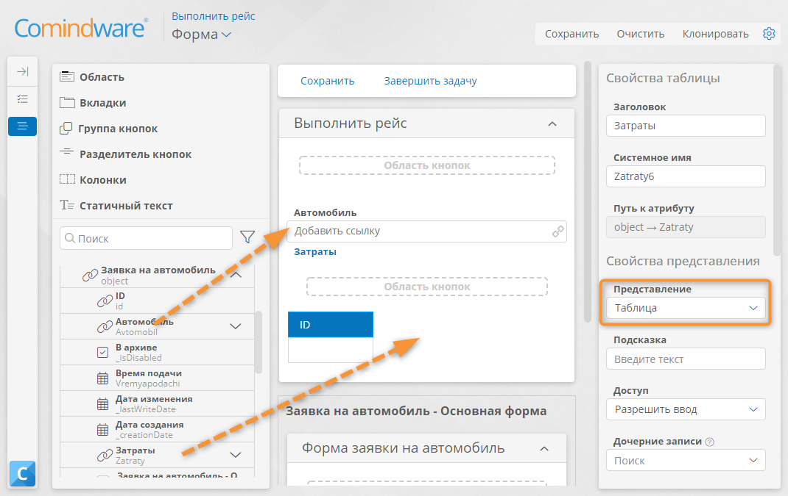
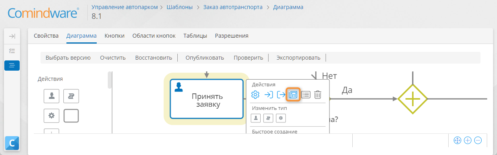
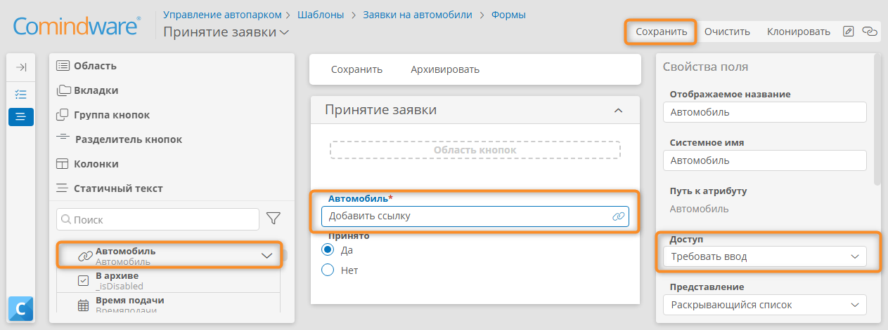
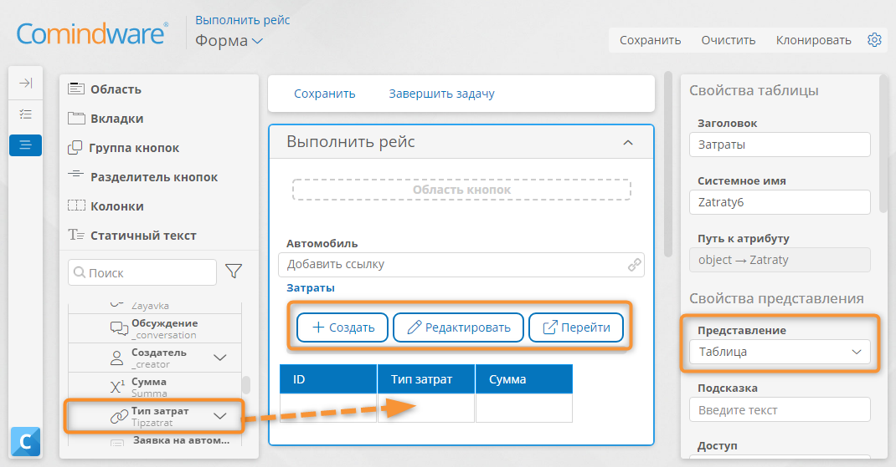
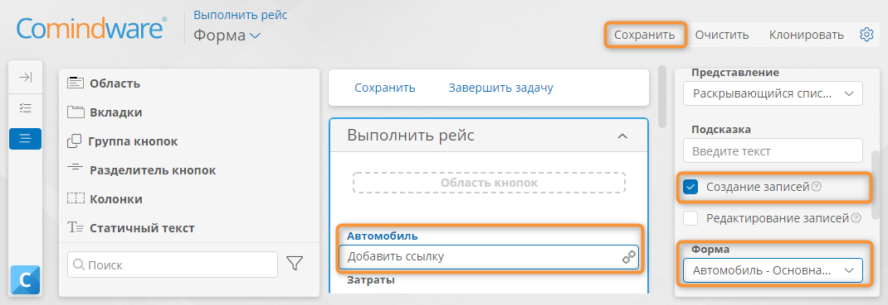
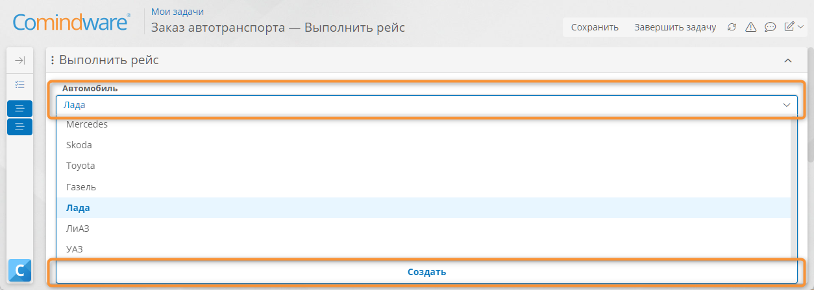

# Урок 6. Усовершенствованный процесс {: #lesson_6 }

## Введение

В ходе этого урока вы усовершенствуете процесс заказа автомобиля, используя созданные на предыдущем уроке шаблоны записей (реестры) (_Типы автомобилей, Автомобили, Затраты, Типы затрат_), — добавите возможность выбора типа машины из справочника во время оформления заявки и настроите учёт машин в гараже и отслеживание расходов.

**Предусловия:** пройден _[урок 5 «Структуры данных»][lesson_5]_.

**Расчётная продолжительность:** 100 мин.



## Настройка выбора типа автомобиля при оформлении заявки

Добавим возможность выбора типа автомобиля для _Заказчика_ при создании заявки. Для этого настроим основную форму заявки.

1. Перейдите к шаблону _«Заявки на автомобили»_.
2. Выберите вкладку «**Формы**».
3. Откройте конструктор формы _«Заявки на автомобили — Основная форма»_.
4. Перетащите на макет формы атрибут _«Тип автомобиля»_.
5. Сохраните форму.

__

## Настройка выбора автомобиля при выполнении рейса

Настроим форму для задачи _«Принять заявку»_, чтобы _Диспетчер гаража_ мог выбрать машину для выполнения рейса.

1. Перейдите к диаграмме процесса _«Заказ автотранспорта»_.
2. Нажмите кнопку «**Редактировать**».
3. Выберите задачу _«Принять заявку»_.
4. В меню элемента нажмите кнопку «**Форма**» <i class="fa-light fa-newspaper"></i>.

    __

5. Разверните элемент _«Заявки на автомобиль»_ на панели элементов.
6. Перетащите атрибут _«Автомобиль»_ в область _«Принятие заявки»_.
7. Укажите для поля _«Автомобиль»_ **режим доступа** «**Требовать ввод**».
8. Сохраните форму.

    __

## Настройка учёта затрат во время выполнения рейса

!!! warning "Бизнес-логика"

    Когда _Водитель_ получит задачу _«Выполнить рейс»_, он должен увидеть номерной знак забронированного автомобиля.

    Мы также дадим _Водителю_ возможность добавить новый автомобиль в список и отслеживать затраты на поездку.

    Для этого добавим раскрывающийся список _«Автомобиль»_ и таблицу _«Затраты»_ на форму задачи _«Выполнить рейс»_.

1. На диаграмме процесса выберите задачу _«Выполнить рейс»_ и с помощью меню элемента перейдите к ее форме.
2. Разверните элемент _«Заявки на автомобиль»_.
3. Перетащите атрибуты _«Автомобиль»_ и _«Затраты»_ на область _«Выполнить рейс»_.
4. В панели свойств для поля _«Затраты»_ выберите **представление** «**Таблица**».

    __

5. Разверните элемент _«Затраты»_ на панели элементов.
6. Перетащите атрибуты _«Тип затрат»_ и _«Сумма»_ в таблицу _«Затраты»_ на форме.
7. Выберите **область кнопок** таблицы _«Затраты»_ и перетащите на нее из панели элементов кнопки «**Создать**», «**Редактировать**» и «**Перейти**». Это позволит пользователю создавать, редактировать и просматривать записи о затратах в таблице _«Затраты»_ на форме.

    __

## Настройка атрибута «Итоговая сумма затрат»

Добавим в шаблон _«Заявки на автомобили»_ атрибут, хранящий итоговую сумму затрат на рейс.

1. Нажмите кнопку «**Добавить атрибут**» у атрибута _«Заявки на автомобили»_ в панели элементов.
2. Настройте **новый атрибут**:

    - **Название:** _Итоговая сумма затрат_
    - **Тип данных: число**
    - **Количество знаков после запятой: 2**

    __

3. Перетащите атрибут _«Итоговая сумма затрат»_ в область _«Выполнить рейс»_ под таблицу _«Затраты»_.
4. Сохраните форму задачи _«Выполнить рейс»_.
5. Вернитесь к диаграмме процесса, нажав кнопку «**Назад**» в браузере.
6. Опубликуйте диаграмму процесса.

!!! question "Версии экземпляров процессов"

    Изменения на диаграмме процесса вступают в силу только после ее публикации.

    При публикации создаётся новая версия диаграммы:
    
    - Экземпляры процесса, запущенные по старой версии диаграммы, будут выполняться до конца по этой версии. 
    
    - Новые экземпляры процесса будут выполняться по новой версии диаграммы.

## Тестирование выбора автомобиля и учёта затрат

1. Перейдите на вкладку «**Свойства**» шаблона процесса _«Заказ автотранспорта»_.
2. Нажмите кнопку «**Перейти к экземплярам**».
3. В списке экземпляров процесса запустите новый процесс, нажав кнопку «**Создать**».
4. Заполните поля заявки и укажите тип автомобиля.
5. Нажмите кнопку «**Создать**».
6. Перейдите на страницу «**Мои задачи**» с помощью панели навигации слева.
7. Откройте задачу _«Заказ автотранспорта — Рассмотреть заявку»_
8. Установите флажок _«Заявка одобрена»_.
9. Завершите задачу.
10. Вернитесь на страницу «**Мои задачи**».
11. Откройте задачу _«Заказ автотранспорта — Принять заявку»_.
12. В поле _«Автомобиль»_ выберите автомобиль из раскрывающегося списка.
13. Укажите в поле _«Принято» — «Да»_ и завершите задачу.
14. Вернитесь на страницу «**Мои задачи**».
15. Откройте задачу _«Выполнить рейс»_.
16. Нажмите кнопку «**Создать**» в таблице _«Затраты»_.
17. Укажите сумму и тип затрат в таблице.
18. Нажмите кнопку «**Сохранить**».
19. Добавьте еще несколько записей в таблицу затрат.
20. Завершите задачу.

## Настройка добавления мастер-данных на лету

Реализуем для _Водителя_ возможность ввода данных нового автомобиля перед выполнением рейса.

1. Вернитесь к диаграмме процесса _«Заказ автотранспорта»_.
2. Нажмите кнопку «**Редактировать**».
3. Перейдите к форме задачи _«Выполнить рейс»_.
4. Выберите поле _«Автомобиль»_ на форме и в его свойствах установите флажок «**Создание записей**».
5. Укажите **форму** для создания записей: _«Автомобиль — Основная форма»._

    __

6. Сохраните форму задачи.
7. Опубликуйте диаграмму процесса.

!!! note "Примечание"

    Установив флажок «**Создание записей**» в свойствах раскрывающегося списка, мы даём пользователю возможность создавать записи с помощью формы связанного шаблона.

    Когда этот флажок установлен для поля _«Автомобиль»_, _Водитель_ сможет добавить новый автомобиль «на лету».

## Тестирование добавления нового автомобиля перед выполнением рейса

1. Запустите процесс и пройдите его до задачи _«Выполнить рейс»_.
2. В форме задачи _«Выполнить рейс»_ нажмите кнопку «**Создать**» в поле _«Автомобиль»._

    __

3. Заполните поля отобразившейся формы и сохраните её.
4. Завершите задачу.

## Результаты

В ходе этого урока вы настроили для _Диспетчера гаража_ форму задач и возможность выбора типа автомобиля, реализовали для _Водителя_ возможность добавления нового автомобиля перед выполнением рейса и протестировали усовершенствованный процесс.

В [следующем уроке][lesson_7] вы настроите автоматическое вычисление номера, статуса и итоговой суммы затрат по заявке, а также фильтрацию при выборе типа автомобиля.


