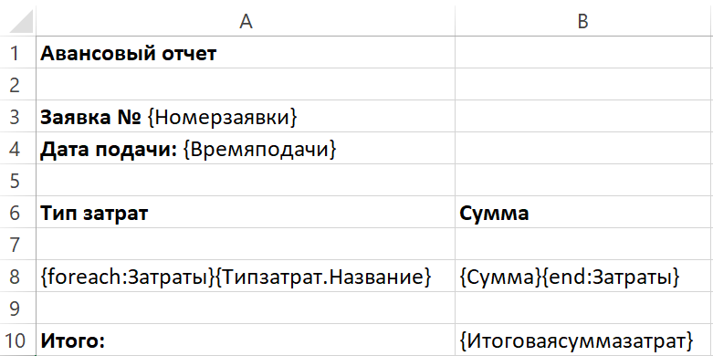
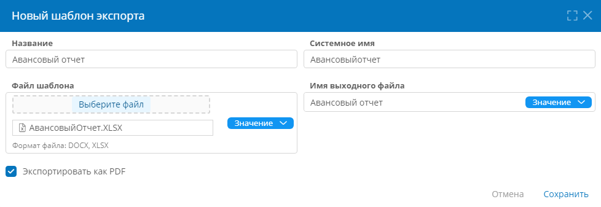
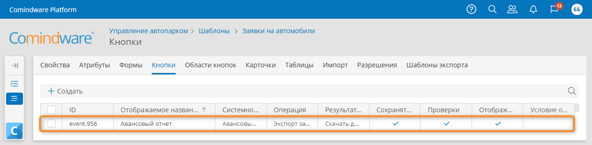
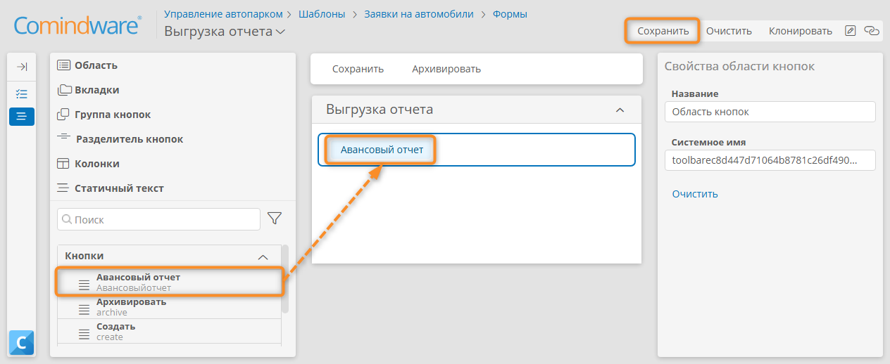
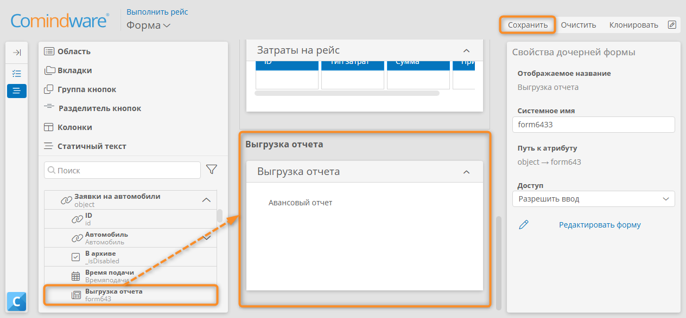
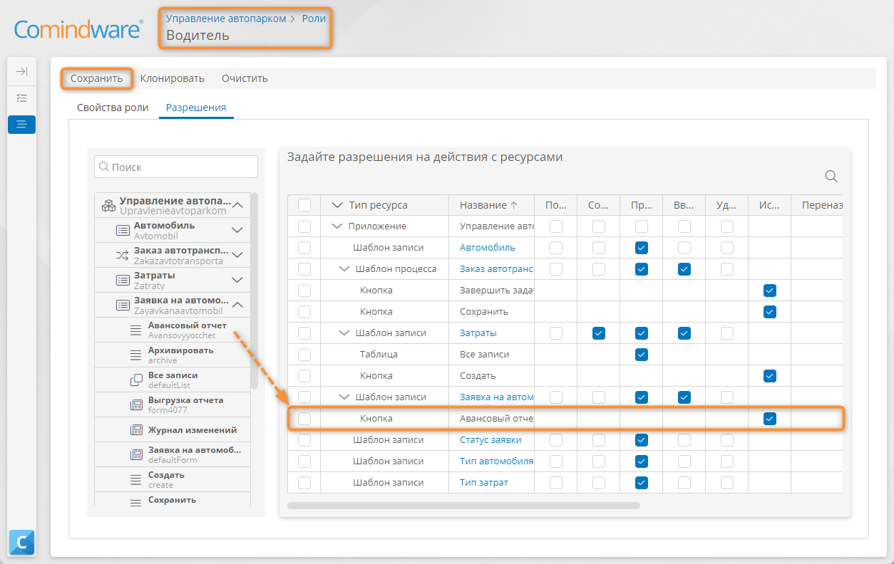

# Урок 9. Формирование документов {: #lesson_9 }

## Введение

В ходе этого урока вы настроите экспорт PDF-отчёта о затратах на основе данных процесса и по шаблону в формате Excel.

Подробные сведения об использовании шаблонов экспорта см. в статье _«[Шаблоны экспорта][export_templates]»_.

**Предусловие:** пройден _[урок 6 «Усовершенствованный процесс»][lesson_6]_.

**Расчётная продолжительность:** 80 мин.



## Формирование авансового отчёта

!!! warning "Бизнес-логика"

    После выполнения рейса _Водитель_ должен скачать отчёт в формате PDF с отчётом о понесённых затратах.
   


### Создание файла шаблона экспорта

1. Создайте файл Excel `Авансовыйотчёт.XLSX`.
2. Заполните лист Excel, как показано на следующей иллюстрации.

__

!!! warning "Внимание!"

    В **файле шаблона экспорта** необходимо указывать те системные имена, которые вы фактически использовали в своём приложении.

    Например, если вы присвоили атрибуту _«Номер заявки»_ системное имя `Номерзаявки123`, то именно это имя следует использовать в файле шаблона экспорта.

    То есть, если системные имена, приведённые в уроках, не совпадают с фактическими системными именами в вашем приложении, используйте фактические системные имена, а не копируйте их из текста уроков.

!!! question "Синтаксис файла шаблона экспорта"

    Файл шаблона экспорта (в формате Excel или Word) может содержать произвольное содержимое и заполнители вида `{ }`. 
    
    При экспорте заполнители заменяются экспортированными данными, а остальное содержимое файла шаблона остается неизменным.
    
    Таким образом, вы можете создать сложный макет, например, счет-фактуру, и заполнить его экспортированными данными.

    Можно экспортировать отдельные значения атрибутов и наборы данных.

    - Чтобы экспортировать значение атрибута текущего шаблона, укажите его системное имя в фигурных скобках, например: `{Номерзаявки}`.
    - Чтобы экспортировать значение атрибута связанного шаблона, системное имя атрибута типа «**Запись**», точку и системное имя атрибута связанного шаблона, например: {Типзатрат.Название}
    - Чтобы экспортировать набор значений из шаблона, связанного с атрибутом типа «**Запись**», используйте операторы `foreach` и `end`:
        - в начале строки в фигурных скобках укажите оператор `foreach`, двоеточие и системное имя атрибута типа «**Запись**», например: `{foreach:Затраты}`;
        - затем перечислите в фигурных скобках системные имена атрибутов связанного шаблона, например: `{Типзатрат.Название} {Сумма}`;
        - в конце строки введите оператор `end`, двоеточие и системное имя атрибута типа «**Запись**» — `{end:Затраты}`.

    - Для экспорта данных из шаблона _«Заявки на автомобили»_ используем следующие системные имена его атрибутов:

        - `Итоговаясуммазатрат`
        - `Номерзаявки`
        - `Времяподачи`
    
    - Для экспорта данных из связанного шаблона _«Затраты»_ используем следующую конструкцию:
        
        ```
        {foreach:Расходы} {Тип.Название} {Сумма} {end:Расходы}
        ```

        Здесь:

        - `Затраты` — атрибут типа «**Запись**» в шаблоне _«Заявки на автомобили»_, связанны с шаблоном _«Затраты»_.
        - `Сумма` и `Типзатрат` — атрибуты шаблона _«Затраты»_.
        - `Типзатрат` — атрибут типа «**Запись**» в шаблоне _«Затраты»_, связанный с шаблоном _«Типы затрат»_. 
        - `Название` — атрибут шаблона _«Типы затрат»_.

## Настройка шаблона экспорта

1. Откройте шаблон записи _«Заявки на автомобили»_.
2. Перейдите на вкладку «**Шаблоны экспорта**».
3. Нажмите кнопку «**Создать**».
4. Отобразится окно «**Новый шаблон экспорта**».
5. Укажите **название** шаблона экспорта _«Авансовый отчёт»_.
6. В поле «**Файл шаблона**» выберите пункт «**Значение**»  и загрузите созданный ранее файл `Авансовыйотчёт.XLSX`.
7. В поле «**Имя выходного файла**» выберите пункт «**Значение**» и укажите требуемое имя экспортируемого файла с данными (без расширения файла), например: `Авансовый отчёт`.
8. Установите флажок «**Экспортировать как PDF**».
9. Нажмите кнопку «**Сохранить**».

!!! warning "Формирование имени выходного файла"

    Когда пользователь нажмёт кнопку экспорта, будет сформирован файл с заданным **именем выходного файла** c расширением `DOCX` или `XSLX` (как у исходного файла шаблона экспорта), либо PDF (если установлен флажок «**Экспортировать как PDF**»).

    **Имя выходного файла** также можно задать с помощью формулы или текстового атрибута.

__

## Настройка кнопки экспорта отчёта

При создании шаблона экспорта автоматически создается кнопка экспорта.

Эту кнопку необходимо добавить на форму или в таблицу, чтобы выгружать данные.

### Проверка кнопки экспорта

Удостоверимся, что кнопка экспорта соответствует нашим требованиям.

1. Перейдите на вкладку «**Кнопки***» шаблона _«Заявки на автомобили»_.*

    __

2. Откройте кнопку _«Авансовый отчёт»_
3. Проверьте корректность свойств кнопки:

    - **отображаемое название** — Авансовый отчёт;
    - **контекст операции**— **Запись**;
    - **операция —** **Экспорт записи**;
    - **результат выполнения** — **Скачать документ**;
    - **шаблон экспорта** — Авансовый отчёт.

    __

### Добавление кнопки экспорта на форму пользовательской задачи

Поместим кнопку для выгрузки отчёта о затратах на форму задачи _«Выполнить рейс»_.

1. Откройте шаблон _«Заявки на автомобили»_.
2. Перейдите на вкладку «**Формы**».
3. Создайте новую форму.
4. Введите **отображаемое название** формы — _«Выгрузка отчёта»_.
5. Измените **отображаемое название** автоматически созданной **новой области** на _«Выгрузка отчёта»_.
6. Выделите область кнопок _«Выгрузка отчёта»_ и перетащите на неё кнопку _«Авансовый отчёт»_.
7. Сохраните форму.

    __

8. Откройте диаграмму процесса _«Заказ автотранспорта»_.
9. Нажмите кнопку «**Редактировать**».
10. Выберите задачу _«Выполнить рейс»_ и в меню элемента нажмите кнопку «**Форма**» <i class="fa-light fa-newspaper">‌</i>.
11. Разверните в панели элементов шаблон _«Заявки на автомобили»_
12. Перетащите форму _«Выгрузка отчёта»_ под область _«Выполнить рейс»_.
13. Сохраните форму задачи.

    __

14. Опубликуйте диаграмму процесса _«Заказ автотранспорта»_.

### Настройка разрешения на использование кнопки экспорта

Для того чтобы _Водитель_ мог воспользоваться кнопкой _«Авансовый отчёт»_, необходимо предоставить ему соответствующее разрешение с помощью роли _«Водитель»_.

1. Откройте раздел «**Роли***» приложения _«Управление автопарком»_.
2. Откройте роль _«Водитель»_.
3. Перейдите на вкладку «**Разрешения**».
4. Раскройте в панели ресурсов шаблон _«Заявки на автомобили»_.
5. Перетащите кнопку _«Авансовый отчёт»_ на таблицу разрешений.
6. Установите для кнопки _«Авансовый отчёт»_ разрешение «**Использование кнопки**»*.
7. Сохраните роль.

    __

## Тестирование экспорта отчёта о затратах

<!--account-switch-note-start-->
!!! note "Примечание"

    Если вы прошли _[Урок 8 _«Аккаунты, группы и роли»_][lesson_8]_, пользовательские задачи назначаются разным аккаунтам.
    
    Для прохождения процесса вы можете выполнять пользовательские задачи одним из трёх способов:

    - Войдите в систему несколько раз с разными аккаунтами: _Заказчик, Секретарь, Водитель, Диспетчер гаража_.
    - Создайте заявку на автомобиль. Откройте диаграмму запущенного экземпляра процесса _«Заказ автотранспорта»_. Переходите к задачам с помощью кнопки «**Перейти**» <i class="fa-light fa-external-link-square"></i> на панели «**Токены**».
    - Назначьте свой аккаунт исполнителем всех пользовательских задач.
<!--account-switch-note-end-->

1. Перейдите к списку экземпляров шаблона _«Заказ автотранспорта»_.
2. Создайте новую заявку.
3. С помощью страницы «**Мои задачи**» пройдите процесс до задачи _«Выполнить рейс»_.
4. Откройте форму задачи _«Выполнить рейс»_ и заполните таблицу затрат.
5. Нажмите кнопку «**Сохранить**».
6. Нажмите кнопку _«Авансовый отчёт»_ и дождитесь экспорта (скачивания) сформированного PDF-документа.

    __

7. Откройте экспортированный документ.
8. Завершите задачу.

    __

## Результаты

Вы научились формировать и экспортировать документ по шаблону в формате Excel, подставляя в него фактические данные из приложения.

В ходе [следующего урока][lesson_10] вы научитесь прикреплять файлы к записям.


