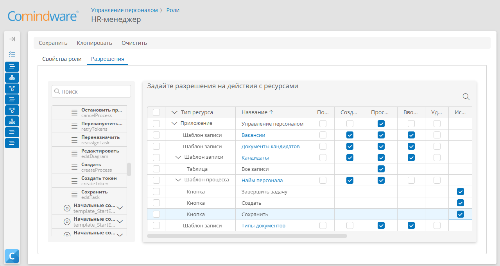
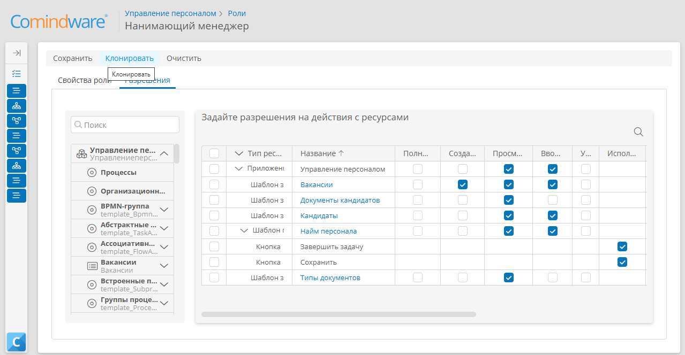
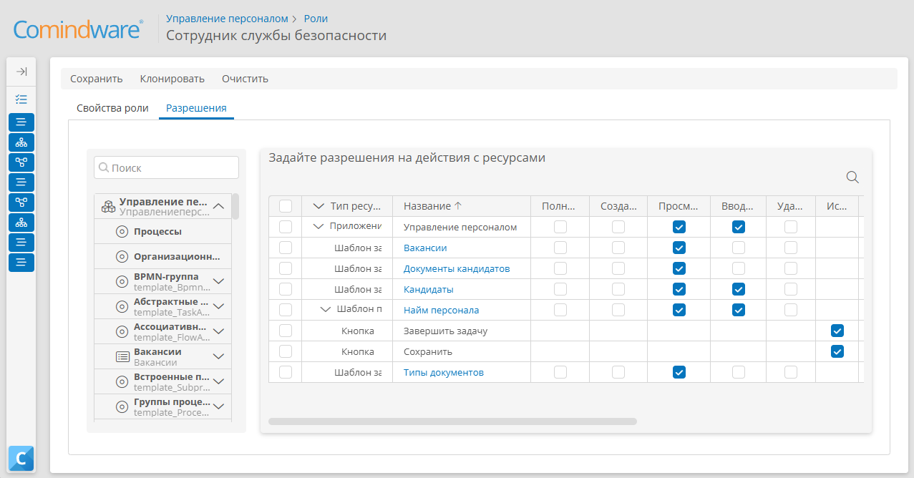
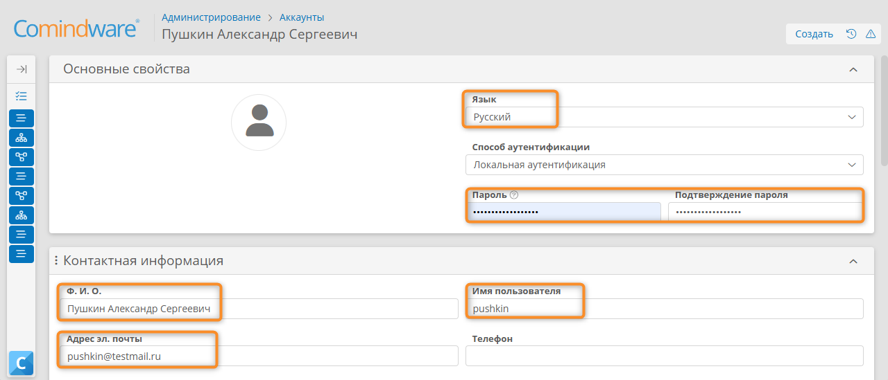
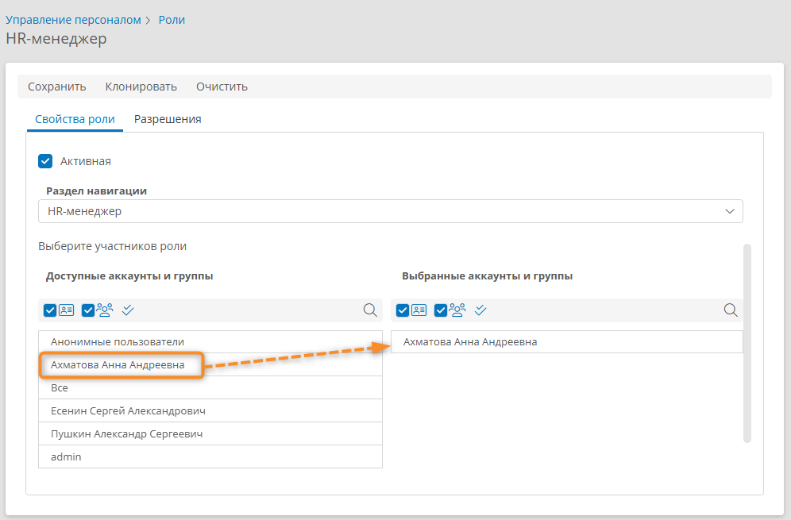

# Урок 6. Управление доступом: аккаунты, роли, навигация {: #tutorial_hr_lesson_6 }

## Введение {: #tutorial_hr_lesson_6_intro }

В ходе этого урока вы научитесь настраивать права доступа для участников процесса найма персонала: создавать аккаунты, определять роли, выдавать разрешения и настраивать разделы навигации для разных категорий пользователей в соответствии с их полномочиями.

**Предусловия:** пройден [урок 3. Мой первый бизнес-процесс][tutorial_hr_lesson_3].

**Расчётная продолжительность:** 50 мин.



!!! warning "Бизнес-логика"

    Для приложения управления персоналом необходимо настроить **роли** пользователей согласно их полномочиям:

    - _HR-менеджер_ — должен иметь возможность создавать, редактировать и просматривать данные вакансий, кандидатов и документы.
    - _Нанимающий менеджер_ — назначает дату собеседования и проводит его с кандидатом, должен иметь возможность редактирования и просмотра вакансий и кандидатов, а также просмотра документов.
    - _Сотрудник службы безопасности_ — проверяет документы кандидата, должен иметь возможность просматривать данные вакансий, кандидатов и документы.
    - Все пользователи должны иметь возможность завершать назначенные им задачи.

## Темы, навыки и задания урока {: #tutorial_hr_lesson_6_taxonomy }

**Темы**

- Аккаунты
- Роли
- Права доступа
- Раздел навигации

**Навыки**

- Управление правами доступа аккаунтов
- Создание аккаунтов
- Настройка ролей
- Понимание модели разрешений CRUD: создание, просмотр, редактирование, обновление и удаление объектов

**Задания**

- Создать роли согласно бизнес-логике процесса.
- Настроить разрешения роль на использование шаблонов, таблиц, форм, кнопок и других объектов.
- Создать аккаунты и назначить и роли согласно полномочиям по процессу.

## Определения {: #tutorial_hr_lesson_6_definitions }

- **Аккаунт** — учётная запись пользователя, предоставляющая доступ к системе.
- **Роль** — набор разрешений, определяющий доступ пользователя к данным и функциям приложения (ресурсам приложения: шаблонам (реестрам), таблицам, кнопкам, формам, задачам процессов и др.) согласно полномочиям пользователя (например, _HR-менеджер, Нанимающий менеджер, Служба безопасности_).
- **Права доступа** — разрешения на создание, просмотр (чтение), редактирование и удаление конкретных ресурсов (CRUD — create, read, update, delete).
- **Раздел навигации** — меню, предоставляющее доступ к разделам и функциям приложения в соответствии с ролью пользователя.

## Настройка ролей

!!! question "Управление правами доступа с помощью ролей"

    Чтобы задать права доступа с помощью **роли** необходимо:
    
    - создать роль для определённых полномочий;
    - настроить для роли разрешения на доступ к ресурсам приложения;
    - назначить роль пользователям и (или) группам пользователей;
    - выбрать раздел навигации, который будет отображаться для пользователей, относящихся к данной роли.

### Настройка роли «HR-менеджер»

1. С помощью панели навигации слева прейдите в раздел «**Настройки**» — «**Приложения**».
2. Откройте приложение _«Управление персоналом»_.
3. Перейдите к странице «**Роли**» <i class="fa-light fa-user-shield"></i>.
4. В списке ролей нажмите кнопку «**Создать**».
5. Отобразится страница свойств новой роли.
6. Укажите **название** роли — _«HR-менеджер»_.
7. Теперь определим разрешения для роли _«HR-менеджер»_.

    !!! warning "Бизнес-логика"

        Чтобы _HR-менеджер_ имел возможность инициировать процесс обработки кандидата на вакансию и завершать свои задачи, настроим разрешения на доступ к шаблону процесса _«Найм персонала»_ и его кнопкам.

8. Перейдите на вкладку «**Разрешения**».

    __

9. В списке слева разверните процесс _«Найм персонала»_ и перетащите в таблицу разрешений справа кнопки «**Создать**», «**Сохранить**» и «**Завершить задачу**».
10. Установите флажок (разрешение) в столбце «**Просмотр**» для приложения _«Управление персоналом»_.
11. Установите флажки (разрешения) в столбце «**Создание**» и «**Просмотр**» для шаблона процесса _«Найм персонала»_.
12. Для кнопок «**Создать**» и «**Завершить задачу**» установите разрешения «**Использование кнопки**».

    __

    !!! warning "Бизнес-логика"

        Чтобы _HR-менеджер_ мог добавлять документы и выбирать тип документа при обработке данных кандидата, настроим доступ для просмотра данных из шаблона _«Документы кандидатов»_ справочника _«Типы документов»_.

13. Перетащите на таблицу разрешений шаблон _«Типы документов»_.
14. Установите для него разрешение «**Просмотр**» и «**Ввод данных**».
15. Перетащите на таблицу разрешений шаблон _«Документы кандидатов»_.
16. Установите для него разрешение «**Просмотр**», «**Ввод данных**» и «**Создание**».

    !!! warning "Бизнес-логика"

        Чтобы _HR-менеджер_ мог создавать записи о кандидатах, просматривать их список, добавлять вакансии, настроим доступ к шаблону записи _«Кандидаты»_ и _«Вакансии»_.

17. Разверните элемент _«Кандидаты»_ на панели элементов слева и перетащите таблицу «**Все записи**» в таблицу разрешений.
18. Перетащите в таблицу разрешений форму _«Кандидаты — Основная форма»_.
19. Установите разрешения «**Создание**», «**Ввод данных**» и «**Просмотр**» для шаблона записи _«Кандидаты»_.
20. Установите разрешение «**Просмотр**» для основной формы и таблицы «**Все записи**» шаблона _«Кандидаты»_.
21. Перетащите на таблицу разрешений шаблон _«Вакансии»_.
22. Установите для него разрешение «**Просмотр**», «**Ввод данных**» и «**Создание**».
23. Сохраните роль _«HR-менеджер»_.

__

### Настройка роли «Нанимающий менеджер»

!!! warning "Бизнес-логика"

    Чтобы _Нанимающий менеджер_ мог рассматривать кандидата, проводить собеседование и выставлять оценку за него, настроим доступ к шаблону процесса _«Найм персонала»_ и шаблонам записи _«Кандидаты»_, _«Вакансии»_, _«Документы кандидатов»_ и _«Типы документов»_.

1. Создайте роль _«Нанимающий менеджер»_.
2. Перейдите на вкладку «**Разрешения**».
3. Перетащите в таблицу разрешений шаблон процесса _«Найм персонала»_ и установите для него разрешения «**Просмотр**» и «**Ввод данных**».
4. Разверните процесс _«Найм персонала»_ и перетащите в таблицу разрешений кнопки «**Завершить задачу**» и «**Сохранить**».
5. Установите для кнопок «**Завершить задачу**» и «**Сохранить**» разрешение «**Использование кнопки**».
6. Установите разрешение «**Просмотр**» для приложения _«Управление персоналом»_.
7. Перетащите в таблицу разрешений шаблон _«Кандидаты»_ и установите для него разрешение «**Просмотр**» и «**Ввод данных**».
8. Перетащите в таблицу разрешений шаблоны _«Вакансии»_ и установите для него разрешение «**Создание**», «**Просмотр**» и «**Ввод данных**».
9. Перетащите в таблицу разрешений шаблоны _«Документы кандидатов»_ и _«Типы документов»_ и установите для них разрешение «**Просмотр**».
10. Сохраните роль _«Нанимающий менеджер»_.

__

### Настройка роли «Сотрудник службы безопасности»

!!! warning "Бизнес-логика"

    Чтобы _Сотрудник службы безопасности_ мог проверять документы кандидата, настроим доступ к шаблону процесса _«Найм персонала»_ и шаблонам записи _«Кандидаты»_, _«Вакансии»_, _«Документы кандидатов»_ и _«Типы документов»_.

1. Создайте роль _«Сотрудник службы безопасности»_.
2. Перейдите на вкладку «**Разрешения**».
3. Перетащите в таблицу разрешений процесс _«Найм персонала»_ и установите разрешения «**Просмотр**» и «**Ввод данных**».
4. Разверните процесс _«Найм персонала»_ и перетащите в таблицу разрешений кнопки «**Завершить задачу**» и «**Сохранить**».
5. Установите для кнопок «**Завершить задачу**» и «**Сохранить**» разрешение «**Использование кнопки**».
6. Установите разрешение «**Просмотр**» для приложения _«Управление персоналом»_.
7. Перетащите в таблицу разрешений шаблон _«Кандидаты»_ и установите для него разрешение «**Просмотр**» и «**Ввод данных**».
8. Перетащите в таблицу разрешений шаблоны _«Вакансии»_ и установите для него разрешение «**Просмотр**».
9. Перетащите в таблицу разрешений шаблоны _«Документы кандидатов»_ и _«Типы документов»_ и установите для них разрешение «**Просмотр**».
10. Сохраните роль _«Сотрудник службы безопасности»_.

__

## Настройка панели навигации {: #tutorial_hr_lesson_6_navigation }



1. На боковой панели навигации выберите пункт «**Настройки**» — «**Приложения**».
2. В списке приложений выберите _«Управление персоналом»_.
3. Перейдите к странице «**Разделы навигации**» <i class="fa-light fa-list-dropdown"></i>.
4. В списке разделов навигации откройте раздел _«HR-менеджер»_ (он был создан на _[уроке 6][tutorial_hr_lesson_7]_).
5. Откроется конструктор раздела навигации.
6. Удостоверьтесь, что в панели свойств выбрано **приложение** _«Управление персоналом»_.
7. Назначьте разделу навигации роль, для пользователей которой он будет отображаться:

    - На панели свойств раздела навигации нажмите пункт «**0 ролей**».
    - В окне _«Роли»_ укажите роль _«HR-менеджер»_.
    - Нажмите кнопку «**Применить**».

    __

8. Настройте пункты, которые будут отображаться в разделе навигации для _HR-менеджера_:

    - Перетащите элемент «**Мои задачи**» с левой панели на макет раздела навигации.
    - Разверните пункты «**Шаблоны процессов**» — _«Найм персонала»_ — «**Кнопки**».
    - Перетащите кнопку «**Создать**» на макет раздела навигации.

9. Сохраните раздел навигации.

!!! example "Факультативное задание"

    Самостоятельно настройте разделы навигации для ролей _«Нанимающий менеджер»_ и _«Сотрудник службы безопасности»_ согласно их полномочиям.

__

## Назначение исполнителей задач

!!! warning "Бизнес-логика"

    До этого момента все пользовательские задачи процесса _«Найм персонала»_ назначались текущему пользователю (то есть вашему аккаунту).
    
    Мы создали роли и настроили их разрешения. 
    
    Теперь назначим роли _«HR-менеджер»_, _«Нанимающий менеджер»_ и _«Сотрудник службы безопасности»_ в качестве исполнителей соответствующих задач.

1. На панели навигации выберите пункт «**Настройки**» — «**Приложения**».
2. Перейдите к приложению _«Управление персоналом»_.
3. Откройте раздел «**Шаблоны**» <i class="fa-light fa-briefcase"></i>.
4. Перейдите к шаблону процесса _«Найм персонала»_.
5. Перейдите на вкладку «**Диаграмма**» и нажмите кнопку «**Редактировать**».
6. Выберите пользовательскую задачу _«Зафиксировать результаты тестирования»_.
7. В меню элемента нажмите кнопку «**Свойства**» <i class="fa-light fa-gear">‌</i>.
8. Перейдите на вкладку «**Дополнительные**».
9. В поле «**Исполнители**» снимите флажок со своего аккаунта и установите флажок _«HR-менеджер»_.
10. Нажмите кнопку «**Сохранить**».

    __

11. Для задачи _«Провести собеседование»_ назначьте исполнителем роль _«Нанимающий менеджер»_.
12. Для задачи _«Провести проверку кандидата»_ назначьте исполнителем роль _«Сотрудник службы безопасности»_.
13. Для задачи _«Сформировать и согласовать предложение с кандидатом»_ назначьте исполнителем роль _«HR-менеджер»_.
14. Опубликуйте диаграмму процесса.

## Создание аккаунтов

!!! warning "Бизнес-логика"

    Чтобы протестировать использование приложения в разных ролях, создадим аккаунты сотрудников с соответствующими должностями (_HR-менеджер_, _Нанимающий менеджер_, _Сотрудник службы безопасности_).

1. На панели навигации выберите пункт «**Настройки**» — «**Аккаунты**» <i class="fa-light fa-address-card"></i>.
2. В списке аккаунтов нажмите кнопку «**Создать**».
3. В поле «**Язык**» укажите «**Русский**».
4. В поле «**Ф.&nbsp;И.&nbsp;О.**» укажите полное имя сотрудника.
5. В поле «**Имя пользователя**» укажите логин, под которым сотрудник будет входить в свой аккаунт.
6. Укажите **пароль** и адрес **эл.&nbsp;почты**.
7. Нажмите кнопку «**Создать**», чтобы сохранить аккаунт.
8. Вернитесь к списку аккаунтов и создайте ещё два аккаунта.

__

## Назначение аккаунтам ролей

1. На боковой панели выберите пункт «**Настройки**» — «**Роли**» <i class="fa-light fa-user-shield"></i>.
2. В отобразившемся списке ролей откройте роль _«HR-менеджер»_, дважды нажав её.
3. На вкладке «**Свойства роли**» в области «**Выберите участников роли**» нажмите аккаунт _HR-менеджера_, чтобы перенести его в список «**Выбранные аккаунты и группы**».
4. Сохраните роль _«HR-менеджер»_.
5. Вернитесь к списку ролей и откройте роль _«Нанимающий менеджер»_.
6. Укажите для роли _«Нанимающий менеджер»_ аккаунт _Нанимающего менеджера_ и сохраните роль.
7. Укажите для роли _«Сотрудник службы безопасности»_ аккаунт _Сотрудника службы безопасности_ и сохраните роль.

__

## Тестирование

!!! note "Примечание"

    Для тестирования настроенных ролей и исполнителей вам понадобится несколько раз войти в созданные аккаунты с различными ролями — _«HR-менеджер», «Нанимающий менеджер»_ и _«Сотрудник службы безопасности»_. 
    
    Посмотреть имена пользователей аккаунта можно на странице «**Настройки**» — «**Аккаунты**».
    
    Для удобства проводите тестирование новом окне браузера в режиме _«Инкогнито»_ или в разных браузерах.

### Фиксация результатов тестирования — HR-менеджер

1. Войдите в аккаунт _HR-менеджера_.
2. Выберите пункт «**Создать**» на панели навигации.
3. Перейдите к странице «**Мои задачи**» с помощью панели навигации.
4. Откройте задачу _«Зафиксировать результаты тестирования»_, дважды нажав её.
5. Заполните поля формы.
6. Установите значение _«Тестирование пройдено»_.
7. Завершите задачу.
8. Выйдите из системы: для этого нажмите значок пользователя в правом верхнем углу страницы и выберите пункт «**Выход**».

### Собеседование — Нанимающий менеджер

1. Войдите в аккаунт _Нанимающего менеджера_.
2. Перейдите к странице «**Мои задачи**» с помощью панели навигации.
3. Откройте задачу _«Провести собеседование»_, дважды нажав её.
4. Установите значение _8_ в поле _«Оценка собеседования»_.
5. Завершите задачу.
6. Выйдите из системы.

### Проверка кандидата — Служба безопасности

1. Войдите в аккаунт _Сотрудника службы безопасности_.
2. На странице «**Мои задачи**» откройте задачу _«Провести проверку кандидата»_.
3. Установите значение _«Прошёл проверку»_.
4. Завершите задачу.
5. Выйдите из системы.

### Согласование предложения с кандидатом — HR-менеджер

1. Войдите в аккаунт _HR-менеджера_.
2. Откройте задачу _«Сформировать и согласовать предложение с кандидатом»_.
3. Завершите задачу.
4. Выйдите из системы.

## Результаты

Вы научились настраивать роли и определять права доступа, создавать аккаунты, а также настраивать разделы навигации.

Вы улучшили процесс: теперь выполнением задач процесса занимаются пользователи с ролями, соответствующими их должностям. В целях безопасности и удобства работы пользователи имеют доступ только к тем ресурсам приложения, которые им предназначены.

В [следующем уроке][tutorial_hr_lesson_7] вы научитесь строить ER-диаграммы и диаграммы бизнес-способностей, отслеживать ход процесса по его диаграмме, настраивать дашборды для мониторинга процесса найма, а также сортировать и группировать данные в таблицах.


