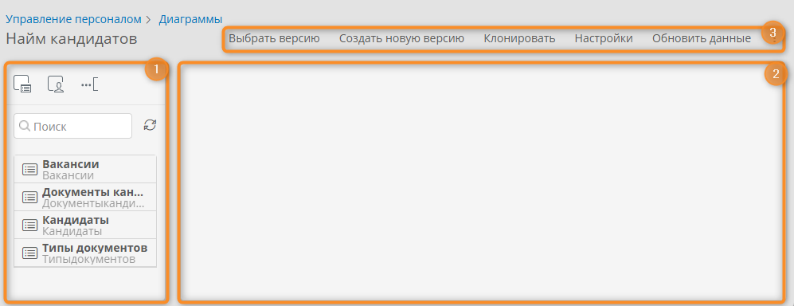
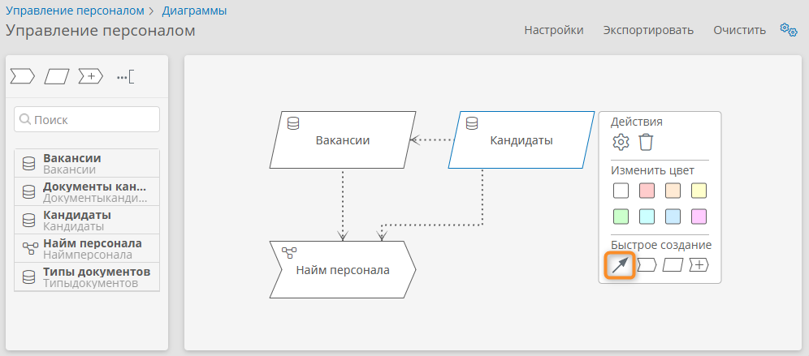
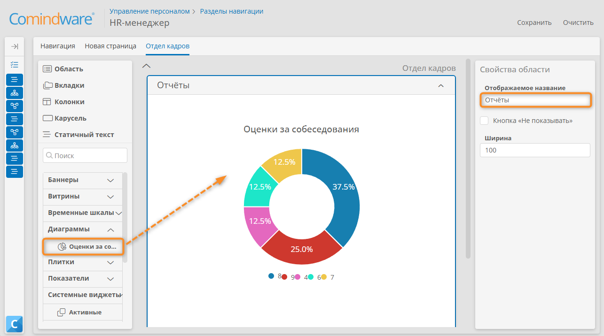
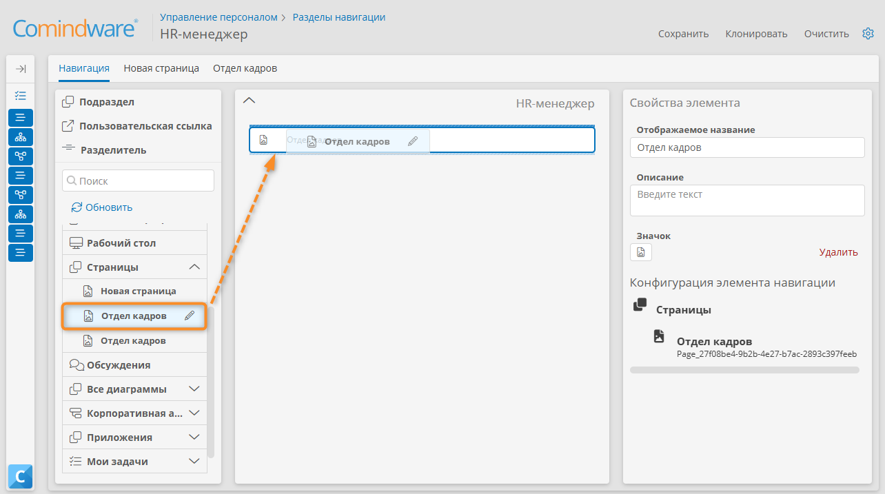
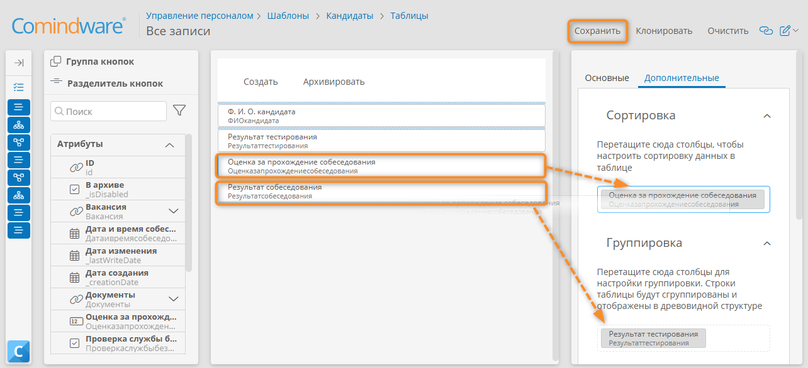

# Урок 7. Аналитика и мониторинг: диаграммы, дашборды, фильтры {: #tutorial_hr_lesson_7 }

## Введение {: #tutorial_hr_lesson_7_intro }

В ходе этого урока вы научитесь строить диаграммы моделей данных и бизнес-способностей, создавать дашборды, настраивать таблицы с сортировкой и группировкой, а также использовать диаграмму процесса для мониторинга статусов кандидатов. Все действия выполняются на примере процесса найма персонала.

**Предусловия:** пройден [урок 6. Управление доступом: аккаунты, роли, навигация][tutorial_hr_lesson_6].

**Расчётная продолжительность:** 60 мин.



!!! warning "Бизнес-логика"

    В рамках процесса найма персонала _HR-менеджеру_ и руководству необходимо регулярно отслеживать ход подбора кандидатов, анализировать эффективность этапов и принимать решения на основе актуальных данных.

    Для этого реализуем следующие возможности:

    1. В приложении создадим диаграммы бизнес-способностей и модели данных.
    2. Настроим кольцевую диаграмму с оценками за собеседования и список кандидатов с группировкой по результату тестирования.
    3. _HR-менеджер_ и руководитель могут просматривать дашборд на рабочем столе.
    4. На дашборде отображаются ключевые показатели: процент успешно прошедших собеседование кандидатов, динамика по месяцам и кварталам.
    5. Руководитель может анализировать диаграммы бизнес-способностей и модели данных для выявления узких мест и оптимизации процесса.

## Темы, навыки и задания урока {: #tutorial_hr_lesson_7_taxonomy }

**Темы**

- Диаграмма модели данных
- Диаграмма бизнес-способностей
- Дашборды
- Таблицы, сортировка и группировка
- Диаграмма процесса
- Токены

**Навыки**

- Составление диаграмм модели данных (ER-диаграммы)
- Составление диаграмм бизнес-способностей
- Создание информационных страниц (дашбордов) с диаграммами
- Настройка таблиц
- Настройка сортировки и группировки в таблицах
- Управление процессом с помощью его BPMN-диаграммы

**Задания**

- Создать диаграмму модели данных для процесса найма персонала.
- Создать диаграмму бизнес-способностей для найма.
- Создать раздел навигации для HR-менеджера.
- Создать информационную страницу (дашборд) на Рабочем столе.
- Создать кольцевую диаграмму с бизнес-показателями и поместить её на дашборд.
- Настроить таблицу с перечнем кандидатов.
- Настроить сортировку и группировку данных в таблице.

## Определения {: #tutorial_hr_lesson_7_definitions }

- **Диаграмма модели данных (ER-диаграмма)** — представление структуры данных приложения, связей между шаблонами и атрибутами.
- **Диаграмма бизнес-способностей** — представление архитектуры бизнес-процесса и его ресурсов.
- **Диаграмма процесса** — представление бизнес-процесса и состояния его экземпляра в нотации BPMN&nbsp;2.0.
- **Токен** — маркер, указывающий на текущий этап выполнения процесса на BPMN-диаграмме.
- **Дашборд** — информационная страница с визуальными отчётами, диаграммами и показателями.
- **Таблица** — представление записей в виде набора строк и столбцов с возможностью сортировки, группировки и фильтрации данных.

## Построение диаграммы модели данных (ER-диаграмма) {: #tutorial_hr_lesson_7_er_diagram }

Построим диаграмму модели данных (сущность-связь, ER), показывающую взаимосвязи между сущностями приложения.

1. Перейдите в раздел «**Диаграммы**» приложения _«Управление персоналом»_.
2. Нажмите кнопку «**Создать**».
3. Выберите тип диаграммы _«Модель данных»_.
4. Введите название диаграммы _«Найм кандидатов»_.
5. Нажмите кнопку «**Сохранить**».

    __

6. Отобразится конструктор диаграммы модели данных.

    __

    

7. Добавьте на диаграмму шаблоны _«Кандидаты»_, _«Вакансии»_, _«Документы кандидатов»_, _«Типы документов»_.
8. Нажмите любой шаблон на диаграмме.
9. В меню элементов нажмите кнопку «**Показать связанные элементы**» <i class="fa-light fa-link">‌</i>.
10. Удостоверьтесь, что все связи между шаблонами отображаются корректно.
11. Диаграмма модели данных готова, руководители могут использовать её для утверждения и оптимизации процесса.

    

__

## Построение диаграммы бизнес-способностей {: #tutorial_hr_lesson_7_capability_diagram }

Построим диаграмму бизнес-способностей, показывающую архитектуру процесса и ресурсов для найма персонала.

1. Перейдите в раздел «**Диаграммы**» приложения _«Управление персоналом»_.
2. Создайте диаграмму со следующими свойствами:

    - **Название:** _Управление персоналом_
    - **Тип: Диаграмма бизнес-способностей**

3. Добавьте способность _«Найм персонала»_ и ресурсы _«Вакансии»_ и _«Кандидаты»_ на диаграмму.
4. Нажмите ресурс _«Кандидаты»_.
5. В меню «**Быстрое создание**» нажмите кнопку «**Линия**».
6. Соедините ресурс _«Кандидаты»_ со способностью _«Найм персонала»_.
7. Аналогичным образом соедините ресурс _«Вакансии»_ со способностью _«Найм персонала»_ и ресурс _«Кандидаты»_ с ресурсом _«Вакансии»_.
8. Диаграмма бизнес-способностей готова, руководители могут использовать её для утверждения и оптимизации процесса.

__

## Настройка страницы с кольцевой диаграммой количества успешно прошедших кандидатов {: #tutorial_hr_lesson_7_dashboard_nav }

Настроим раздел навигации для _HR-менеджера_ и поместим в него информационную страницу (дашборд) с кольцевой диаграммой, показывающей сводку по оценкам кандидатов по результатам собеседований.

1. Перейдите в раздел «**Навигация**» <i class="fa-light fa-list-dropdown"></i> приложения _«Управление персоналом»_.
2. В списке разделов навигации нажмите кнопку «**Создать**».
3. Отобразится конструктор раздела навигации.
4. На панели свойств раздела навигации укажите **отображаемое название** раздела навигации _«HR-менеджер»_.
5. Сохраните раздел навигации.
6. Обновите страницу в браузере после сохранения раздела навигации, чтобы последующие шаги выполнялись корректно.
7. В панели элементов слева нажмите кнопку «**Создать страницу**» <i class="fa-light fa-plus"></i> рядом с пунктом «**Страницы**».

    __

8. Откроется вкладка «**Новая страница**».
9. В панели свойств укажите **название** страницы _«Отдел кадров»_.
10. Сохраните страницу.
11. Обновите страницу в браузере, чтобы последующие шаги выполнялись корректно. Если браузер выдаст предупреждение о возможной утрате несохранённых изменений, подтвердите обновление страниц.
12. Нажмите кнопку со значком «**Создать диаграмму**» <i class="fa-light fa-plus"></i> рядом с пунктом «**Диаграммы**» в панели элементов.

    __

13. Откроется конструктор диаграммы.
14. Настройте диаграмму с помощью панели «**Свойства виджета**»:

    - **Название:** _Оценки за собеседования_
    - **Отображаемое название:** _Оценки за собеседования_
    - **Тип: кольцевая**
    - **Шаблон:** _Кандидаты_ — источник данных для диаграммы.
    - **Категории:** _Оценка за собеседование_ — атрибут, по значениям которого будут сгруппированы записи на диаграмме.

15. Просмотрите и сохраните результирующую диаграмму.

    __

16. Нажмите в браузере кнопку «**Назад**», чтобы вернуться к странице _«Отдел кадров»_.
17. Перетащите новую **область** на макет страницы и переименуйте ее в _«Отчёты»_.
18. Перетащите диаграмму _«Оценки за собеседования»_ из панели элементов в область _«Отчёты»_.
19. Сохраните страницу _«Отдел кадров»_.

    __

20. Перейдите на вкладку «**Навигация**».
21. Перетащите страницу _«Отдел кадров»_ из панели элементов на макет раздела навигации.
22. Сохраните раздел навигации.
23. Протестируйте диаграмму _«Оценки за собеседования»_:

    - Выйдите из системы.
    - Войдите с аккаунтом _HR-менеджера_.
    - В панели навигации выберите пункт _«Отдел кадров»_.

__

## Мониторинг процесса и позиций токенов {: #tutorial_hr_lesson_7_process_monitoring }

Просмотрим историю экземпляра процесса _«Найм персонала»_.



1. В списке шаблонов откройте шаблон процесса _«Найм персонала»_, дважды нажав его.
2. Откройте список экземпляров процесса, нажав кнопку «**Перейти к экземплярам**» на вкладке «**Свойства**» шаблона процесса.
3. В списке выберите один из запущенных экземпляров процесса, дважды нажав его.
4. Отобразится представление истории процесса, в котором активный элемент диаграммы будет выделен зелёным цветом.
5. Выберите задачу _«Зафиксировать результаты тестирования»_ на диаграмме процесса.
6. На панели справа отобразится информация о её выполнении.
7. Перейдите на вкладку «**Журнал изменений**» и разверните задачу _«Зафиксировать результаты тестирования»_ для просмотра информации о ней.
8. Аналогично выберите любой другой элемент диаграммы процесса для просмотра сведений о нём.

!!! example "Факультативное задание"

    Поэкспериментируйте с диаграммой экземпляра процесса, например принудительно остановите его или создайте токены на элементах и понаблюдайте за результирующим поведением.

__

## Настройка столбцов, сортировки и группировки списка кандидатов {: #tutorial_hr_lesson_7_table_filters }

Настроим состав столбцов и фильтры в таблице со списком кандидатов.

1. Перейдите в шаблон записи _«Кандидаты»_.
2. Откройте вкладку «**Таблицы**»
3. Откройте таблицу _«Все записи»_.
4. Отобразится конструктор таблицы.
5. Нажмите кнопку «**Очистить**».
6. Перетащите следующие атрибуты с панели элементов на макет таблицы: _«Ф.&nbsp;И.&nbsp;О. кандидата»_, _«Результат тестирования»_, _«Оценка за прохождение собеседования»_, _«Результат собеседования»_.
7. Сохраните таблицу.

    

8. Выберите вкладку «**Дополнительные**» справа от макета таблицы.
9. Перетащите столбец _«Оценка за прохождение собеседования»_ с макета на блок «**Сортировка**».
10. В блоке «**Сортировка**» нажмите поле _«Оценка за прохождение собеседования»_ и выберите **сортировку** «**По убыванию**».
11. Перетащите столбец _«Результат тестирования»_ с макета на блок «**Группировка**».
12. Сохраните таблицу.
13. Просмотрите результирующее представление данных в таблице.

!!! example "Факультативное задание"

    Поэкспериментируйте с настройкой фильтра таблицы. Например, попробуйте выводить только кандидатов с оценкой за собеседование выше определённого уровня.

__

## Итоги урока {: #tutorial_hr_lesson_7_summary }

Вы научились строить диаграммы модели данных и диаграммы бизнес-способностей, создавать дашборды и страницы для мониторинга показателей, настраивать таблицы для записей.

В ходе [следующего урока][tutorial_hr_lesson_8] вы научитесь формировать отчётные документы с данными из приложения.


