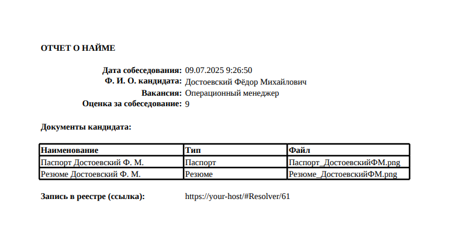

# Урок 8. Экспорт данных {: #tutorial_hr_lesson_8 }

## Введение {: #tutorial_hr_lesson_8_intro }

В ходе этого урока вы научитесь формировать и экспортировать отчёты по процессу найма персонала с помощью шаблонов экспорта и кнопок в интерфейсе **{{ productName }}**. Вы освоите подготовку шаблона Excel, сопоставление атрибутов, настройку кнопки экспорта и выдачу прав на её использование для HR-менеджера.

**Предусловия:** пройден [урок 2 «Первый реестр данных»][tutorial_hr_lesson_2].

**Расчётная продолжительность:** 50 мин.

!!! warning "Бизнес-логика"

    В рамках процесса найма персонала HR-менеджеру необходимо регулярно формировать и выгружать отчёты по кандидатам для анализа и передачи руководству.

    Для этого реализуем следующий порядок действий:

    1. HR-менеджер завершает этапы работы с кандидатом и фиксирует результаты (например, оценку за собеседование).
    2. HR-менеджер открывает список кандидатов или карточку кандидата в системе.
    3. HR-менеджер нажимает кнопку экспорта отчёта в формате PDF.
    4. Система формирует Excel-отчёт на основе шаблона, автоматически подставляя данные о выбранных кандидатах (например, Ф.И.О. и оценка за собеседование).
    5. HR-менеджер скачивает готовый отчёт и передаёт его руководству или использует для дальнейшего анализа.

    Для экспорта используется шаблон Excel с заполнителями, а доступ к кнопке экспорта предоставляется только HR-менеджеру при наличии соответствующих прав.

## Темы, навыки и задания урока {: #tutorial_hr_lesson_8_taxonomy .pageBreak }

**Темы**

- Устройство и настройка шаблона экспорта в Excel
- Сопоставление атрибутов с ячейками шаблона
- Настройка кнопки экспорта и выдача прав на её использование

**Навыки**

- Создание файлов Excel с заполнителями для подстановки данных
- Настройка шаблонов экспорта
- Добавление кнопок экспорта на формы и в таблицы
- Управление правами доступа к операциям экспорта

**Задания**

- Подготовить шаблон Excel для отчёта о найме.
- Настроить шаблон экспорта в системе и задать имя выходного файла в формате PDF.
- Создать и разместить кнопку экспорта в интерфейсе.
- Выдать HR-менеджеру разрешение на использование кнопки экспорта.

## Определения {: #tutorial_hr_lesson_8_definitions }

- **Шаблон экспорта** — файл (в формате Excel или Word) с заполнителями, куда автоматически подставляются значения атрибутов.
- **Экспорт отчёта** — автоматическое формирование документа на основе шаблона экспорта.
- **Кнопка** — элемент интерфейса, запускающий операцию экспорта данных.
- **Разрешение на использование кнопки** — право пользователя запускать экспорт отчёта.

## Формирование шаблона для выгрузки отчёта {: #tutorial_hr_lesson_8_template .pageBreak }



### Создание файла шаблона экспорта {: #tutorial_hr_lesson_8_excel_template .pageBreak }

!!! warning "Внимание!"

    В **файле шаблона экспорта** необходимо указывать те системные имена, которые вы фактически использовали в своём приложении.

    Например, если вы присвоили атрибуту _«Номер заявки»_ системное имя `Номерзаявки123`, то именно это имя следует использовать в файле шаблона экспорта.

    То есть, если системные имена, приведённые в уроках, не совпадают с фактическими системными именами в вашем приложении, используйте фактические системные имена, а не копируйте их из текста уроков.

!!! question "Синтаксис файла шаблона экспорта"

    Файл шаблона экспорта (Excel или Word) может содержать произвольное оформление и специальные заполнители с указанием системных имён шаблонов и атрибутов в фигурных скобках `{системноеИмя}`.
    
    При экспорте система автоматически заменяет заполнители на значения атрибутов, не меняя остальное содержимое файла.
    
    **Примеры заполнителей для процесса найма:**
    
    - Чтобы экспортировать значение атрибута текущего шаблона (например, Ф.И.О. кандидата), укажите его системное имя в фигурных скобках: `{ФИО}`.
    - Чтобы экспортировать значение связанного атрибута (например, название вакансии), укажите системное имя атрибута типа «**Запись**», точку и системное имя атрибута связанного шаблона, например: `{Вакансия.НазваниеВакансии}`.
    - Для экспорта набора связанных данных (например, списка этапов собеседования), используйте конструкцию `foreach ... end`:
        - в начале строки — оператор `foreach`, двоеточие и системное имя атрибута типа «**Запись**»: `{foreach:ЭтапыСобеседования}`;
        - внутри перечислите в фигурных скобках системные имена атрибутов связанного шаблона: `{НазваниеЭтапа} {Оценка}`
        - в конце строки введите оператор `end`, двоеточие и системное имя атрибута типа «**Запись**»: `{end:ЭтапыСобеседования}`
        
    Так вы можете создавать как простые, так и сложные отчёты, автоматически подставляя необходимые бизнес-данные.

<!-- Не надо ли показать выгрузку коллекции как в старых уроках? 
Очень примитивно сейчас. -->

1. Создайте пустой файл Excel `Отчет_о_найме.xlsx`.
2. Заполните его как показано ниже:

    | ОТЧЁТ О НАЙМЕ          |                             |
    | ---------------------- | --------------------------- |
    | **Ф. И. О. кандидата** | **Оценка за собеседование** |
    | `{ФИО}`                | `{Оценказасобеседование}`   |

    **Здесь:** `{ФИО}` и `{Оценказасобеседование}` — системные имена атрибутов. Указывайте их в фигурных скобках.

3. Сохраните файл.

### Настройка шаблона экспорта {: #tutorial_hr_lesson_8_export_template .pageBreak }

1. Перейдите в шаблон записи _«Кандидаты»_.
2. Откройте вкладку **Шаблоны экспорта**.
3. Нажмите «**Создать**».
4. Укажите **название** шаблона экспорта _«Отчёт о найме»_.
5. В поле «**Файл шаблона**» выберите пункт «**Значение**» и прикрепите настроенный ранее файл `Отчет_о_найме.xlsx`.
6. В поле «**Имя выходного файла**» выберите пункт «**Значение**» и укажите требуемое имя файла отчёта с данными (без расширения файла), например: `Отчёт о найме`. Файл с указанным именем будет скачивать HR-менеджер.
7. Установите флажок «**Экспортировать как PDF**».
8. Сохраните шаблон экспорта.

## Настройка кнопки экспорта отчёта {: #tutorial_hr_lesson_8_button .pageBreak }

При создании шаблона экспорта автоматически создается кнопка экспорта.

Эту кнопку необходимо добавить на форму или в таблицу, чтобы выгружать данные.

### Проверка кнопки экспорта {: #tutorial_hr_lesson_8_button_check .pageBreak }

Удостоверимся, что кнопка экспорта соответствует нашим требованиям.

1. Перейдите на вкладку «**Кнопки***» шаблона _«Кандидаты»_.*
2. Откройте кнопку _«Отчёт о найме»_
3. Проверьте корректность свойств кнопки:

    - **Отображаемое название** — _Отчёт о найме_
    - **Контекст операции**— **Запись**
    - **Операция —** **Экспорт записи**
    - **Результат выполнения** — **Скачать документ**
    - **Шаблон экспорта** — _Отчёт о найме_

### Добавление кнопки экспорта на форму пользовательской задачи {: #tutorial_hr_lesson_8_button_form .pageBreak }

Поместим кнопку для выгрузки отчёта на форму задачи _«Сформировать и согласовать предложение с кандидатом»_.

1. Откройте шаблон _«Кандидаты»_.
2. Перейдите на вкладку «**Формы**».
3. Создайте новую форму.
4. Присвойте форме **отображаемое название** _«Выгрузка отчёта»_.
5. Измените **отображаемое название** автоматически созданной **новой области** на _«Выгрузка отчёта»_.
6. Выберите область кнопок области _«Выгрузка отчёта»_ и поместите на неё кнопку _«Отчёт о найме»_.
7. Сохраните форму.
8. Откройте диаграмму процесса _«Найм персонала»_.
9. Нажмите кнопку «**Редактировать**».
10. Выберите задачу _«Сформировать и согласовать предложение с кандидатом»_.
11. В меню элемента нажмите кнопку «**Форма**» <i class="fa-light fa-newspaper">‌</i>.
12. Разверните в панели элементов шаблон _«Кандидаты»_.
13. Поместите вложенную форму _«Выгрузка отчёта»_ в область над формой _«Кандидаты — Основная форма»_.
14. Сохраните форму задачи.
15. Опубликуйте диаграмму процесса _«Найм персонала»_.

### Настройка разрешения на использование кнопки экспорта {: #tutorial_hr_lesson_8_permission .pageBreak }

Для того чтобы _HR-менеджер_ мог воспользоваться кнопкой _«Отчёт о найме»_, ему необходимо предоставить соответствующее разрешение.

Для этого настроим роль _«HR-менеджер»_.

1. Откройте раздел «**Роли***» приложения _«Управление персоналом»_.
2. Откройте роль _«HR-менеджер»_.
3. Перейдите на вкладку «**Разрешения**».
4. Раскройте в панели ресурсов шаблон _«Кандидаты»_.
5. Перетащите кнопку _«Отчёт о найме»_ на таблицу разрешений.
6. Установите для кнопки _«Отчёт о найме»_ разрешение «**Использование кнопки**»*.
7. Сохраните роль.

## Тестирование экспорта отчёта о найме {: #tutorial_hr_lesson_8_test .pageBreak }

1. Перейдите к списку экземпляров шаблона _«Кандидаты»_.
2. Создайте нового кандидата.
3. С помощью страницы «**Мои задачи**» пройдите процесс до задачи _«Сформировать и согласовать предложение с кандидатом»_.
4. Откройте форму задачи _«Сформировать и согласовать предложение с кандидатом»_.
5. Нажмите кнопку «**Сохранить**».
6. Нажмите кнопку _«Отчёт о найме»_ и дождитесь экспорта (скачивания) сформированного PDF-документа.

    <!-- __ -->

7. Откройте экспортированный документ.
8. Завершите задачу.

    <!-- __ -->

## Итоги урока {: #tutorial_hr_lesson_8_summary .pageBreak }

Вы научились формировать и экспортировать PDF-документ по шаблону в формате Excel, подставляя в него фактические данные из приложения.

На этом курс «**Аналитик. Базовый**» завершён. Ознакомьтесь с _[Заключением][tutorial_hr_outro]_.


