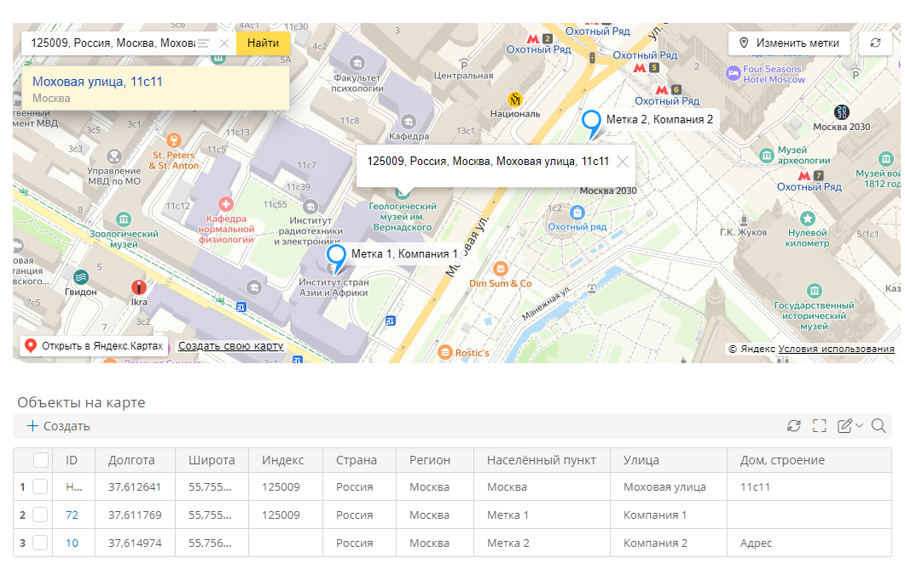

# Карты. Использование {: #map_use}

## Введение

Здесь представлен пример использования Яндекс Карт на форме, настроенной по инструкциям в статье «**[Карты. Настройка][map_configure]**».

Метки на карте можно настраивать двумя способами:

- с помощью графического интерфейса [на карте](#настройка-меток-с-помощью-карты);
- с помощью [таблицы](#настройка-меток-с-помощью-таблицы) на форме, содержащей данные меток.

## Исходные данные

Имеется форма c картой, на которой отображаются метки, и таблицей с данными меток.

## Работа с картой на форме

### Настройка меток с помощью карты

1. Откройте форму с картой и таблицей меток.
2. Нажмите кнопку «**Изменить метки**».

    - Чтобы добавить метку по адресу, введите его в поле «**Адрес или объект**» и нажмите кнопку «**Найти**». Новая метка с искомым адресом отобразится в центре карты.
    - Чтобы добавить метку в произвольной точке на карте, щёлкните её левой кнопкой мыши.
    - Чтобы переместить метку, перетащите её.
    - Чтобы удалить метку, щёлкните её правой кнопкой мыши и подтвердите удаление.

3. Сохраните настроенные метки, нажав кнопку «**Подтвердить**».
4. В [таблице меток](#настройка-меток-с-помощью-таблицы) обновятся данные.
5. Чтобы настроенные метки остались на карте и в таблице, сохраните запись.

### Настройка меток с помощью таблицы {: .pageBreakBefore }

1. Откройте форму с картой и таблицей меток.
2. Создайте в таблице новую строку и введите адресные данные:

    - _Страна_
    - _Регион_
    - _Населённый пункт_
    - _Улица_
    - _Дом, строение_
    - _Индекс_
    - _Широта_
    - _Долгота_

    !!! warning "Внимание!"

        Для отображения метки обязательно введите **широту** и **долготу**. Положение метки на карте зависит только от географических координат.

    !!! tip "Наглядное наименование объекта на карте"

        Отображаемое название метки состоит из населённого пункта и улицы, разделённых запятой. При нажатии метки будет показан её полный адрес: индекс, страна, населённый пункт, улица, дом и строение (через запятую). Регион в адресе метки на карте не отображается.

        В поля _«Индекс»_, _«Страна»_, _«Населённый пункт»_, _«Улица»_ и _«Дом, строение»_ можно ввести произвольные данные, например название компании, которые будут отображаться на карте.

3. Чтобы новая метка из таблицы отобразилась на карте, обновите карту, нажав кнопку <i class="fa-light fa-arrows-rotate"></i>.
4. Чтобы просмотреть данные всех заполненных полей метки, выберите её на карте.
5. Чтобы настроенные метки остались на карте и в таблице, сохраните запись.

__

--8<-- "related_topics_heading.md"

- *[Карты. Настройка][map_configure]*
- *[Динамические элементы формы. Настройка карты][form_dynamic_elements_map]*


